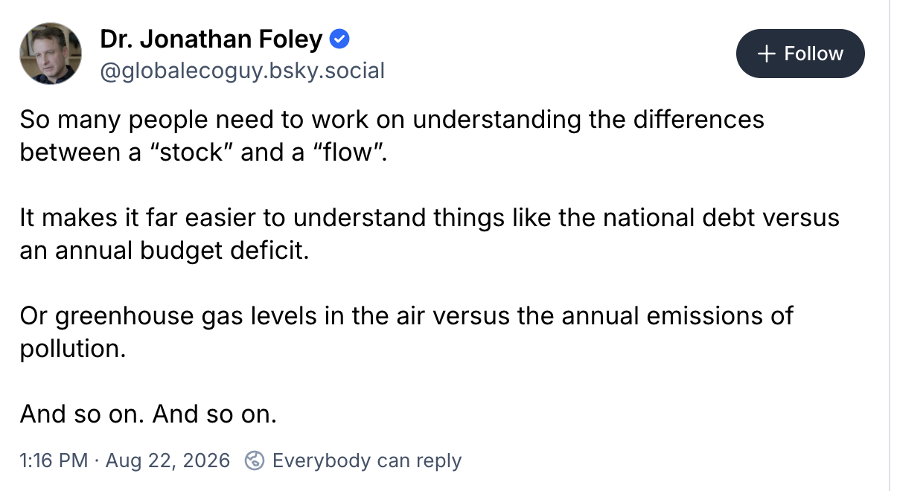

# Course Overview

## About Me

Prof. Vivek Srikrishnan, [viveks@cornell.edu](mailto:viveks@cornell.edu), 318 Riley-Robb

- From Wappingers Falls, NY (via Champaign-Urbana, IL and State College, PA);
- Non-academic highlight: Was on Jeopardy! in 2016;
- Researches climate risk management;
- Particular interest in unintended consequences which result from neglecting uncertainty or system dynamics.

## Meet My Supervisors

::: {.center}
{width=30%}
:::

# Systems Basics

## What Is A System?

A system is:

::: {.quote}
> "an interconnected set of elements that is coherently organized in a way that achieves something...
>
> A system must consist of three kinds of things: *elements*, *interconnections* and *a function or purpose*."

::: {.cite} 
--- Donella Meadows, *Thinking in Systems: A Primer*, 2008 
:::
:::

##  Why Are Systems Interesting?

::: {.incremental}
- "**Interconnected** set of **elements**"
- "**Function** or **purpose**"
:::

## Example: Climate Change

Changes to climate occur based on a variety of processes (***interconnected elements***) across scales which **influence the planet's energy balance** (***function***), including:

- carbon sources/sinks;
- aerosol emissions;
- ocean heat uptake;
- surface albedo;
- teleconnections (*e.g.* El Niño/La Niña)

## Process Compensation

::: {.caption}
Source: @Errickson2021-kr
:::

## Compensations Change Range Of Outcomes

::: {.caption}
Source: @Errickson2021-kr
:::

## Example: Water Pollution

Contaminant levels in a body of water also depend on a number of processes which may have different scales and rates.

**Can we think of some?**

## System State

**System State**: quantities or variables which evolve over time based on external inputs and system dynamics.

The state gives you a "snapshot" of the system at a given point in time.

## Stocks and Flows

::: {.incremental}
- A **stock** is the amount of a system property: concentrations of a pollutant, numbers of currency units, etc.
- A **flow** is the way in which a stock changes: decay, diffusion, production, consumption, etc.
:::

## Stocks and Flows

::: {.caption}
Source: [Jonathan Foley's Bluesky](https://bsky.app/profile/globalecoguy.bsky.social/post/3mtoroswkek2z)
:::

## Residence Time

We can use the notion of stocks and flows to formalize the idea of **residence time**: average time a unit of a stock remains in the system (or a component of the system).

$$
\underbrace{\tau}_{\substack{\text{Residence} \\[0.5em] \text{Time}}} \times \overbrace{F}^{\substack{\text{Flow} \\[0.5em] \text{In/Out}}} = \underbrace{M}_{\text{Stock}}
$$

## Steady-State Residence Time

Steady-state condition on flows $F_\text{in}$ and $F_\text{out}$:

::: {.fragment .fade-in}
$$\begin{gather*}
F_\text{out} = F_\text{in} = F \\
\Rightarrow \bbox[5pt, border: 5px solid red]{\tau = M/F}
\end{gather*}
$$
:::

## But Systems Are Often More Complicated

- Feedbacks (amplifying/dampening)
- Multiple interacting processes
- Non-steady-state behavior
- Multiple metrics/objectives and tradeoffs

# Course Overview

## Example Topics

:::: {.columns}

::: {.column width="50%"}
### Topics

::: {.incremental}

  * Define systems
  * Simulate system dynamics
  * Analyze and assess risk
  * Make decisions with optimization

:::
:::

::: {.column width="50%"}
::: {.fragment .fade-in}

### Example Systems

::: {.incremental}

* Air pollution
* Wastewater management
* Electric power systems
* Solid waste management

:::
:::
:::
::::

## What Do You Hope To Get Out Of This Course?



## Course Organization

1. Introduction to Systems Analysis
2. Simulating Systems and Risk
3. Systems Design and Management with Optimization
4. Decision-Making Under Uncertainty

# Course Policies

## Disclaimer

Sitting in class/looking at these notes is **not a substitute for reading the syllabus**.

## Attendance

Not required, but students tend to do better when they're actively engaged in class.

Lack of attendance could contribute to a low participation grade.

## Office Hours

- Prof. Srikrishnan: TuW 1-2 in 318 Riley-Robb
- TA: TBD
- Will send out a poll, but almost impossible to find a time that works for all (or even most); please feel free to email to make appointments as/if needed.
- Can be busy, will triage based on urgency (e.g. if you want code help but have not done basic debugging steps, you will be asked to wait until others are helped).

## Accomodations

If you have any access barriers in this class, *please* seek out any helpful accomodations.

- Get an SDS letter.
- If you need an accomodation before you have an official letter, please reach out to me ASAP!

## Course Website

<https://envsys.viveks.me/fall2026/>

- Central hub for information, schedule, and policies
- Will add link and some information to Canvas (assignment due dates, etc)

## Communications

Use [Ed Discussion](https://us.edstem.org) for questions and discussions about class, homework assignments, etc.

- Try to use public posts so others can benefit from questions and can weigh in.
- **I will make announcements through Ed, so check regularly**.
- Urgent announcements will also be emailed.

When urgency or privacy is required, email is ok.

## Julia

In this course, we will use the [Julia programming language](https://julialang.org).

All assignments and labs will be provided as Jupyter Notebooks.

You do not have to use the notebooks for your own work.

## What Is Your Programming Experience?



## GitHub/Assignment Repos

Homework assignments and labs will be distributed as GitHub repositories that you fork.

- Every student/team will fork their own copy of the repository.
- When an assignment is released, I will share the link to the repository on Ed Discussion.
- Makes it easy to share code for assistance and debugging (share links to repositories, not out-of-context code and screenshots).

# Grades

## Assessments

| Category | Weight |
|:--------|:------:|
| Labs/Readings | 10% |
| Homework | 15% |
| Mini-Projects | 20% |
| Quizzes | 30% |
| Term Project | 25% |

## Overall Guidelines

- Collaboration *highly* encouraged, but **all work must reflect your own understanding**
- Submit PDFs on Gradescope
- "Standard" rubric available for HW/exams
- **Always cite external references**
- Curve unlikely (not worth asking about...)

## Late Work Policy

- Most work can be submitted up to 24 hours late at a 50% penalty.
- If you have an approved reason (illness, injury, etc), let me know **ahead of time** and we will make accomodations.

## What Are We Grading?

- **Setup and Interpretation**: Can you set up a model, interpret outputs, and explain your reasoning?
- The logic behind your model and approach should be written clearly and you should provide interpretations of the results and what they mean for the problem.
- **Not code**: Will never look at your code while grading unless there is a concern, you don't have to include it but it should be accessible on GitHub.

## Labs

- In-class guided activities, but may need some time after class to complete
- Focus on "how" to apply methods and concepts from class
- **If you can't bring a laptop to these classes, you can work with someone else**
- Can work in groups, but must submit your own work.
- Graded on a scale of 0-2, largely based on effort.

## Readings

Students in BEE 5750 will be required to read and annotate readings during the semester.

Extra lab credit for students in BEE 4750.

**Quality prioritized over quantity**

## Homework Assignments

- Mix of conceptual/analytical questions and light programming exercises.
- Released after prior assignment is due (though some weeks may not have a homework assignment).
- Due by **9:00pm** on the due date.
- Can work in groups of up to 3, only one submission required per group.
- Late submissions within 24 hours accepted at a 50% penalty.
- Will drop the lowest score by default for students in 4750, not for 5750.

## Quizzes

- 6 given in-class during the first 25 minutes.
- Focus on concepts, problem formulations, interpretation.
- **Completely closed book and closed note** (no calculators, phones, or other electronic devices).
- Quizzes will be scanned and put on Gradescope for grades/feedback.
- None dropped by default for students in 5750 but will drop lowest score for students in 4750.

## Mini-Projects

- 3 throughout the semester, each with a different focus (*e.g.* simulation, optimization, and decision-making).
- Will involve a real world application with a problem posed and relevant data provided.
- More open-ended than homeworks.
- Can work in groups of 2 (4750), **5750 students must work alone**.

## Term Project 

- Analyze a system of interest, including the regulatory environment, going beyond class examples/methods.
- Work in groups of 3--4.
- Submit proposal on 10/16/26.
- Record presentation by end of semester for peer review by classmates.
- Submit report and group/self evaluations by end of finals week.

# Academic Integrity

## Hopefully Not a Concern...

- Collaboration is great and is encouraged! 
- Knowing how to find, evaluate, and use helpful resources is a skill we want to develop. 
- Don't just copy...learn from others and give credit.
- Submit your own original work.
- Group solutions should reflect the understanding of all group members.

## AI Policy

Using AI tools is not prohibited. **But**:

- Use them **thoughtfully**;
- Carefully document your query, the output, and how you integrated into your solution, or we can't distinguish LLM output from your own understanding.
- We will grade your submissions on their own basis, but historically LLM-heavy output has not scored well and using LLMs uncritically may make it difficult for you to ask for help.

## How Have You Used AI In Your Coursework?



# Upcoming Schedule

## Next Classes

**Wednesday**: Intro to Systems

## Setup For Class

Follow the guides to install git, Julia, and VS Code:

<https://envsys.viveks.me/fall2026/setup/index.html>

## Assessments

- HW1: Available, due 9/3.