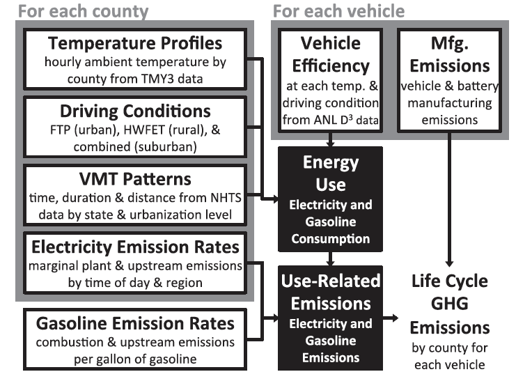
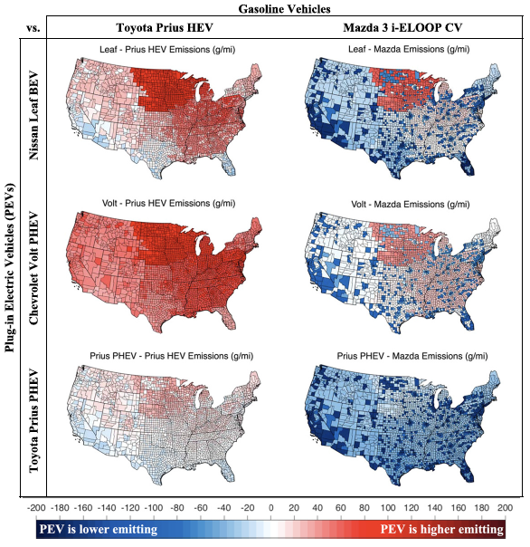
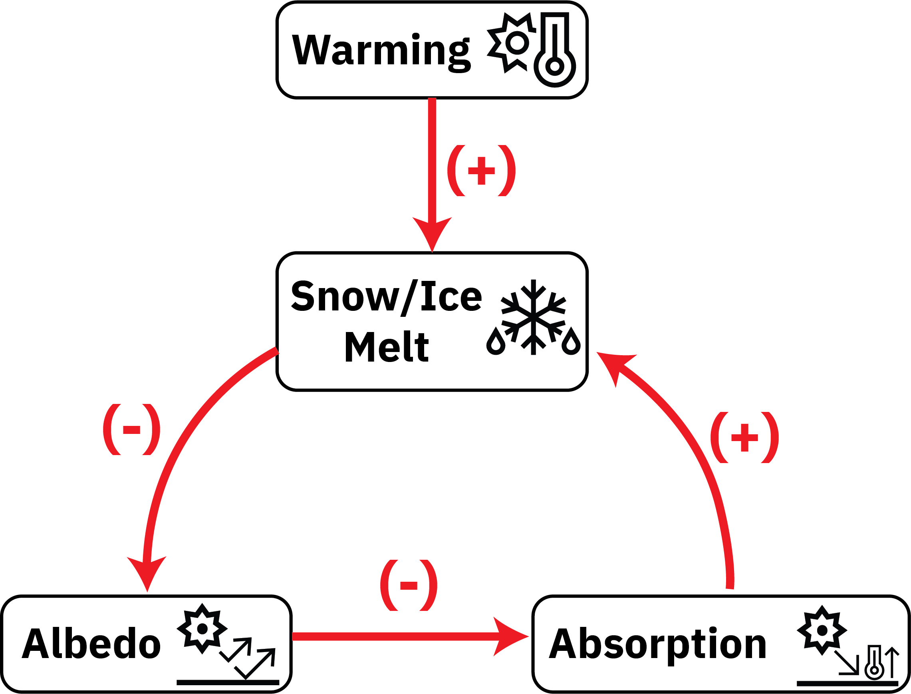
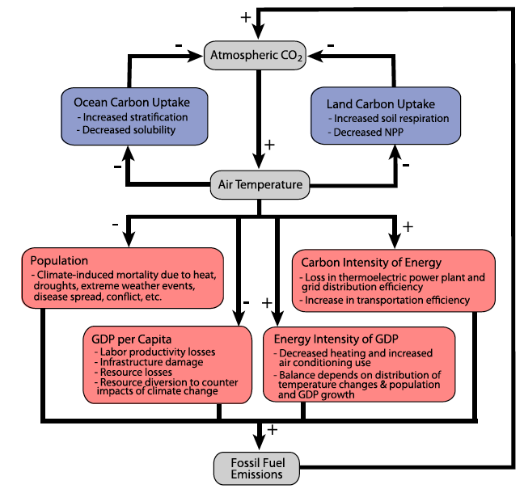
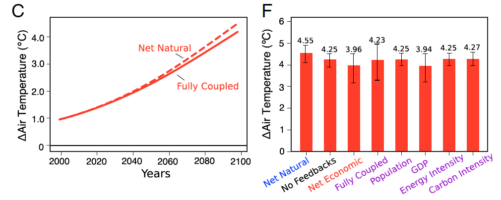

```{julia}
#| output: false
import Pkg
Pkg.activate(@__DIR__)
Pkg.instantiate()
```

```{julia}
#| output: false
using Random
using Plots
using Measures
using DifferentialEquations
using DataFrames
using CSV

plot_font = "Palatino Roman"
default(
    fontfamily=plot_font,
    linewidth=3, 
    framestyle=:box, 
    label=nothing, 
    grid=false,
    guidefontsize=18,
    legendfontsize=16,
    tickfontsize=16,
    titlefontsize=20,
    bottom_margin=10mm,
    left_margin=5mm
)
```

# Review of Last Class

## Systems Analysis

:::: {.columns}

::: {.column width=50%}
### What We Study

- System dynamics;
- Response to inputs;
- Alternatives for management or design.

:::

::: {.column width=50%}
### Needs

::: {.fragment  .fade-in}
- *Definition of the system*
- System model

:::
:::
::::


## What Do We Need To Define A System?

::: {.incremental}
- **Components**: relevant processes, agents, etc
- **Interconnections**: relationships between system components
- **Control volume**: unit of the system we are trying to model and/or manage
- **Inputs**: control policies and/or external forcings
- **Outputs**: measured quantities of interest
:::

## Mathematical Models of Systems


## Environmental Systems

:::: {.columns}
::: {.column width=60%}
{width=100%}
:::

::: {.column width=40%}

- Municipal sewage into lakes, rivers, etc.
- Power plant emissions into air
- Solid waste placed on landfill
- CO<sub>2</sub> into atmosphere

:::
::::

## Other Aspects of Models

- Deterministic vs. Stochastic
- Descriptive vs. Prescriptive
- Mechanistic vs. Statistical

## "All Models Are Wrong, But Some Are Useful"

::: {.quote}

> ...all models are approximations. Essentially, **all models are wrong, but some are useful**. However, the approximate nature of the model must always be borne in mind....

::: {.cite}
--- Box & Draper, *Empirical Model Building and Response Surfaces*, 1987
:::
:::

## Questions?




# System Boundaries

## Defining the System Scope

:::: {.columns}
::: {.column width=50%}
- "Internal" system dynamics vs. "external" conditions is somewhat arbitrary.
- Internal dynamics go into a model.
- External conditions are "forcings," initial conditions, or assumptions.

:::
::: {.column width=50%}
{width=100%}
:::
::::

## Example: Lake Eutrophication

:::: {.columns}
::: {.column width=40%}
**Simple model of lake eutrophication**: 

Assume steady-state behavior, first-order linear decay, well-mixed, constant volume.
:::
::: {.column width=60%}
::: {.fragment}
**Adding more complexity**:


:::
:::
::::

## Systems Diagrams


## Example: EV Life Cycle Assessment

**What factors contribute to the environmental impact of a battery electric vehicle (versus an internal combustion engine)?**

## Possible System/Life Cycle Framework



::: {.caption}
Source: @Yuksel2016-fk
:::

## PHEV vs. Gasoline Outcomes



::: {.caption}
Source: @Yuksel2016-fk
:::

## Constructing Systems Models

Similar principles to models you've seen previously:

- Mass/Energy Balance for stocks;
- Flows can increase stocks or can decay.

**Main difference**: potential presence of feedbacks/non-steady state behavior.

# Feedbacks

## Feedback Types

:::: {.columns}
::: {.column width=60%}
Feedbacks are "loops" in a system diagram.

Feedbacks can be:

- **Amplifying** (sometimes called "positive")
- **Dampening** (sometimes called "negative")

:::

::: {.column width=40%}
{width=100%}
:::

::::

## Amplifying Feedbacks

:::: {.columns}
::: {.column width=50%}
Shocks will amplify as they are propagated:
:::
::: {.column width=50%}


:::
::::

## Dampening Feedbacks

:::: {.columns}
::: {.column width=50%}
Shocks are attenuated (dampened) as they propagate: 
:::
::: {.column width=50%}


:::
::::

## Feedback Level

**With no feedback**: $\text{Total Effect} = \text{Direct Effect}$

**Over one pass feedback loop**: $\text{Total Effect} = (g) (\text{Direct Effect})$

$g$ is the feedback factor (or **gain**): $g > 0$ means **amplification**, $g < 0$ means **dampening**.

## Calculating $g$

If $x = F[p(x, \ldots)]$, $$g = \frac{\partial F}{\partial x} = \frac{\partial F}{\partial p} \frac{\partial p}{\partial x}.$$

With multiple feedback processes ($x = F[p_1(x, \ldots), p_2(x, \ldots), \ldots]$):

$$g = \sum_i \frac{\partial F}{\partial p_i} \frac{\partial p_i}{\partial x} = \sum_i g_i.$$

## Multiple Feedback Passes

$$\begin{aligned}
\text{Total Effect} &= (\text{Direct Effect})\left(1 + g + g^2 + g^3 + \ldots\right) \\[0.5em]
&= \frac{\text{Direct Effect}}{1-g}
\end{aligned}$$

- if $0 < g < 1$: amplifying but stable feedback
- if $g < 0$: dampening feedback
- if $g > 1$: system instability


## Other Environmental Feedbacks

**Can we think of other examples of environmental feedback loops?**

**Are they amplifying or dampening?**

# Example: Climate-Economic Feedbacks

## Climate System Feedbacks



::: {.caption}
Source: @Woodard2019-cz
:::

## Impact of Including Feedbacks



::: {.caption}
Source: @Woodard2019-cz
:::


# Equilibria

## Fixed Points (Equilibria)

System dynamics are often understood relative to their **equilibria** (or fixed points).

* If $X_{t+1} = F(X_t)$, equilibria occur where $F(X_t) = X_t$.
* If $\frac{dx}{dt} = f(x)$, equilibria occur where $f(x) = 0$.

In other words, **a system at an equilibrium will stay at an equilibrium**.

## Example: Predator-Prey Dynamics

```{julia}
#| label: fig-lynxhare-data
#| fig-cap: Lynx and Hare pelt dataset
#| echo: true
#| code-fold: true
#| warning: false

lh_obs = DataFrame(CSV.File("data/lynx_hare/Lynx_Hare.txt", header=[:Year, :Hare, :Lynx]))[:, 1:3]
plot(lh_obs[!, :Year], lh_obs[!, :Lynx], xlabel="Year", ylabel="Pelts (thousands)", markersize=5, markershape=:circle, markercolor=:red, color=:red, linewidth=3, label="Lynx")
plot!(lh_obs[!, :Year], lh_obs[!, :Hare], markersize=5, markershape=:circle, markercolor=:blue, color=:blue, linewidth=3, label="Hare")
plot!(size=(1100, 500))
```


## Predator-Prey Dynamics (Lotka-Volterra)

$$
\begin{align*}
\frac{dH}{dt} &= H_t \underbrace{b_H}_{\substack{\text{birth} \\ \text{rate}}} - H_t (\underbrace{L_t m_H}_{\substack{\text{impact of} \\ \text{lynxes}}}) \\
\frac{dL}{dt} &= L_t\underbrace{(H_t b_L)}_{\substack{\text{impact of} \\ \text{hares}}} - \underbrace{L_t m_L}_{\substack{\text{mortality} \\ \text{rate}}}
\end{align*}
$$

## Lotka-Volterra Fixed Points

:::: {.columns}
::: {.column width=55%}
```{julia}
#| label: fig-lotka-volterra-phase
#| fig-cap: Phase Diagram of the Lotka-Volterra Equations
#| echo: true
#| code-fold: true
#| warning: false

function lotka_volterra!(du, u, p, t)
  # Unpack the values so that they have clearer meaning
  prey, pred  = u
  birth_prey, mort_prey, birth_pred, mort_pred = p

  # Define the ODE
  du[1] = (birth_prey - mort_prey * pred) * prey
  du[2] = (birth_pred * prey - mort_pred) * pred
end

# define model parameters and initial conditions
θ = [1.1, 0.5, 0.1, 0.2]
u₀ = [1, 1]
tspan = 40
prob = ODEProblem(lotka_volterra!, u₀, (0.0, tspan), θ)


# plot phase space
p = plot(xlims=(0, 10), ylims=(0, 6),
    xlabel = "Prey Population (1,000)", ylabel = "Predator Population (1,000)", leg = false)

function phase_plot(prob, u0, θ, p, tspan = 40)
    _prob = ODEProblem(prob.f, u0, tspan, θ)
    sol = solve(_prob, Vern9()) # Use Vern9 solver for higher accuracy
    plot!(p, sol, idxs = (1, 2))
end

for x in 0:0.5:2.5
    for y in 0:0.5:2.5
        phase_plot(prob, [y, x], θ, p)
    end
end

scatter!(p, [0, 2], [0, 2.2], color=:black)
plot!(size=(650, 550))
```

:::

::: {.column width=45%}
This simple model has two fixed points:

1. $L_t = 0, H_t = 0$
2. $L_t = b_H / m_H, H_t = m_L / b_L$

:::
::::

## Paradox of the Pesticides

Improving the birth rate for the prey (increasing $b_H$) does **not** impact the equilibrium prey population, but benefits predators.

Killing more of the prey (increasing $m_H$) similarly impacts predators, not prey.

A similar impact was seen with pesticide deployment: led to widespread die-offs of natural predators of crop pest species, allowing increased flareups of pests.

## Iron Fertilization

**Another example**: iron fertilization (increased phytoplankton are consumed by fish and other predators, decreasing observed carbon sequestration).

# Key Takeaways

## Key Takeaways

- Definition of system boundary strongly influences modeled dynamics and assessments of outcome s (*e.g.* life-cycle assessment or attribution of effects);
- Feedbacks can be amplifying or dampening;
- Systems can include both types of feedbacks: overall effect depends on specifics!
- Equilibria are "fixed points" of the system: more next time!

# Upcoming Schedule

## Next Classes

**Wednesday**: Stability and Bifurcations

**Next Week**: Labor Day (Monday); Quiz 1 (Wednesday)

## Assessments

**Homework 1**: Due **Thursday** at 9pm.

**Reading** (5750): @Woodard2019-cz

# References

## References