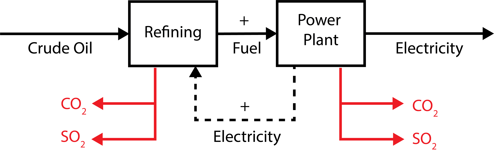
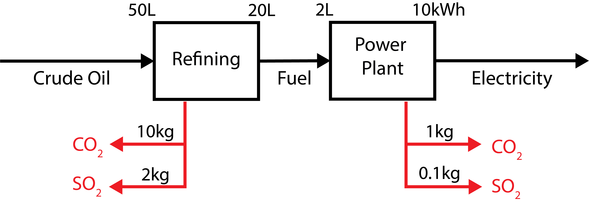
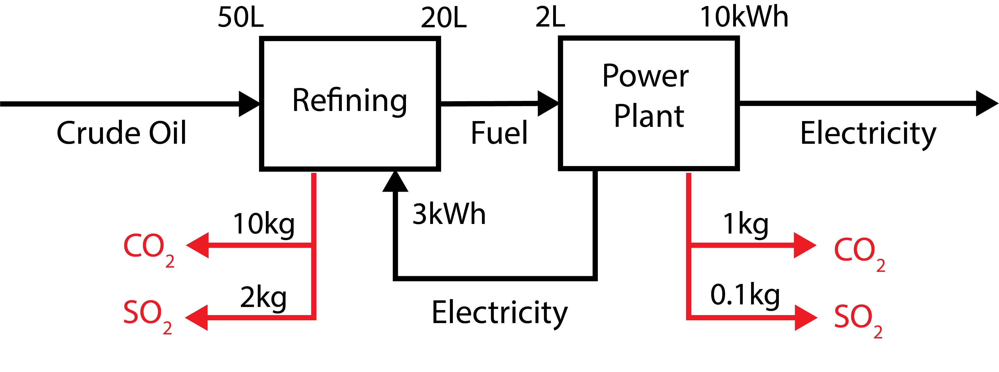

```{julia}
#| output: false
import Pkg
Pkg.activate(@__DIR__)
Pkg.instantiate()
```

```{julia}
#| output: false
using Random
using Plots
using Measures
using DifferentialEquations

plot_font = "Palatino Roman"
default(
    fontfamily=plot_font,
    linewidth=3, 
    framestyle=:box, 
    label=nothing, 
    grid=false,
    guidefontsize=18,
    legendfontsize=16,
    tickfontsize=16,
    titlefontsize=20,
    bottom_margin=10mm,
    left_margin=5mm
)
```

# Review of Last Class

## Systems Analysis

:::: {.columns}

::: {.column width=50%}
### What We Study

- System dynamics;
- Response to inputs;
- Alternatives for management or design.

:::

::: {.column width=50%}
### Needs

::: {.fragment  .fade-in}
- *Definition of the system*
- System model

:::
:::
::::


## What Do We Need To Define A System?

::: {.incremental}
- **Components**: relevant processes, agents, etc
- **Interconnections**: relationships between system components
- **Control volume**: unit of the system we are trying to model and/or manage
- **Inputs**: control policies and/or external forcings
- **Outputs**: measured quantities of interest
:::

## Mathematical Models of Systems


## Environmental Systems

:::: {.columns}
::: {.column width=60%}
{width=100%}
:::

::: {.column width=40%}

- Municipal sewage into lakes, rivers, etc.
- Power plant emissions into air
- Solid waste placed on landfill
- CO<sub>2</sub> into atmosphere

:::
::::

## Other Aspects of Models

- Deterministic vs. Stochastic
- Descriptive vs. Prescriptive
- Mechanistic vs. Statistical

## "All Models Are Wrong, But Some Are Useful"

::: {.quote}

> ...all models are approximations. Essentially, **all models are wrong, but some are useful**. However, the approximate nature of the model must always be borne in mind....

::: {.cite}
--- Box & Draper, *Empirical Model Building and Response Surfaces*, 1987
:::
:::

## Questions?




# System Boundaries

## Defining the System Scope

:::: {.columns}
::: {.column width=50%}
- "Internal" system dynamics vs. "external" conditions is somewhat arbitrary.
- Internal dynamics go into a model.
- External conditions are "forcings," initial conditions, or assumptions.

:::
::: {.column width=50%}
{width=100%}
:::
::::

## Example: Lake Eutrophication

:::: {.columns}
::: {.column width=40%}
**Simple model of lake eutrophication**: 

Assume steady-state behavior, first-order linear decay, well-mixed, constant volume.
:::
::: {.column width=60%}
**But in reality**:


:::
::::

## Systems Diagrams


## Example: EV Life Cycle Assessment

**What factors contribute to the environmental impact of a battery electric vehicle (versus an internal cumbustion engine)?**

## Possible System/Life Cycle Framework


::: {.caption}
Source: @Yuksel2016-fk
:::

## PHEV vs. Gasoline Outcomes


::: {.caption}
Source: @Yuksel2016-fk
:::

## Constructing Systems Models

Similar principles to models you've seen previously:

- Mass/Energy Balance for stocks;
- Flows can increase stocks or can decay.

**Main difference**: potential presence of feedbacks/non-steady state behavior.

# Feedbacks

## Feedback Types

:::: {.columns}
::: {.column width=60%}
Feedbacks are "loops" in a system diagram.

Feedbacks can be:

- **Amplifying** (sometimes called "positive")
- **Dampening** (sometimes called "negative")

:::

::: {.column width=40%}
{width=100%}
:::

::::

## Amplifying Feedbacks

:::: {.columns}
::: {.column width=50%}
Shocks will amplify as they are propagated:
:::
::: {.column width=50%}


:::
::::

## Dampening Feedbacks

:::: {.columns}
::: {.column width=50%}
Shocks are attenuated (dampened) as they propagate: 
:::
::: {.column width=50%}


:::
::::

## Other Environmental Feedbacks

**Can we think of other examples of environmental feedback loops?**

**Are they amplifying or dampening?**


## Simple Example

Consider the following production system:



## Simple Example

If we neglect the electricity feedback, what are the lifecycle implications of generating 1000 kWh of electricity?



## Simple Example

What about if we include the feedback?




# Example: Climate Feedbacks

## Climate System Feedbacks


::: {.caption}
Source: @Woodard2019-cz
:::

## Impact of Including Feedbacks


::: {.caption}
Source: @Woodard2019-cz
:::

## Impact of Including Feedbacks


::: {.caption}
Source: @Woodard2019-cz
:::


# Key Takeaways

## Key Takeaways

- Definition of system boundary strongly influences modeled dynamics and assessments of outcome s (*e.g.* life-cycle assessment or attribution of effects);
- Feedbacks can be amplifying or dampening;
- Amplifying feedbacks can cause instabilities in system dynamics.

# Upcoming Schedule

## Next Classes

**Wednesday**: System Dynamics (Equilibria/Bifurcations)

**Next Week**: Simulation Models

## Assessments

**Homework 1**: Due 9/11 (**Thursday**) at 9pm.

**Reading**: @Woodard2019-cz

# References

## References