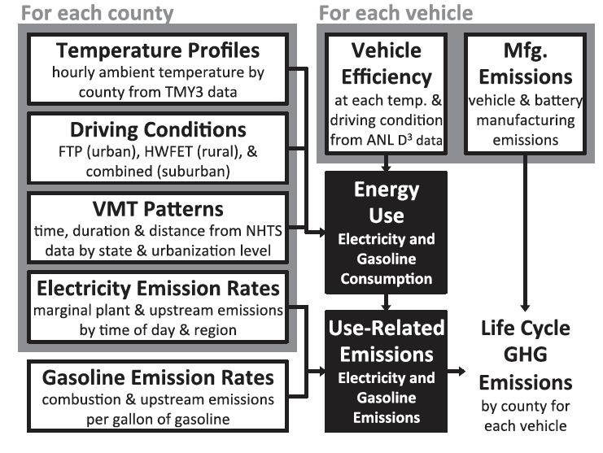
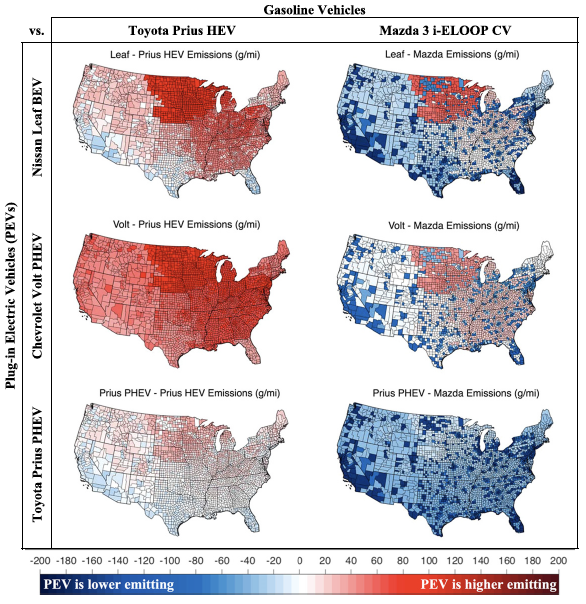
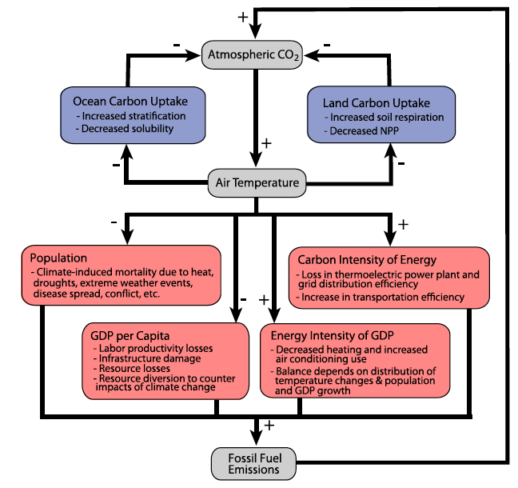
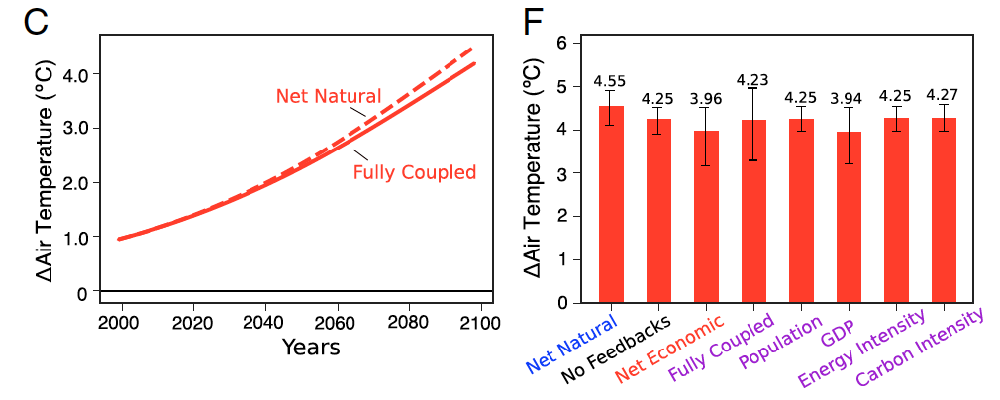
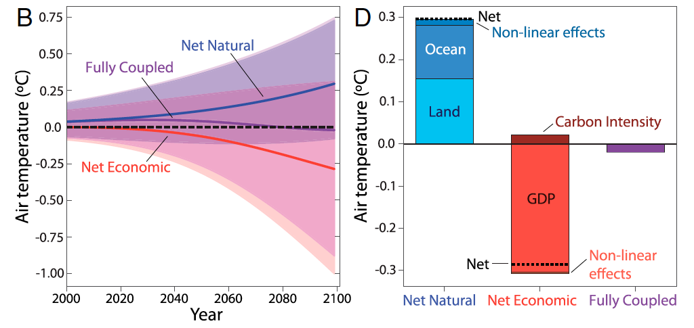

```{julia}
#| output: false
import Pkg
Pkg.activate(@__DIR__)
Pkg.instantiate()
```

```{julia}
#| output: false
using Random
using Plots
using Measures
using DifferentialEquations

plot_font = "Palatino Roman"
default(
    fontfamily=plot_font,
    linewidth=3, 
    framestyle=:box, 
    label=nothing, 
    grid=false,
    guidefontsize=18,
    legendfontsize=16,
    tickfontsize=16,
    titlefontsize=20,
    bottom_margin=10mm,
    left_margin=5mm
)
```

# Review of Last Class

## Systems Analysis

:::: {.columns}

::: {.column width=50%}
### What We Study

- System dynamics;
- Response to inputs;
- Alternatives for management or design.

:::

::: {.column width=50%}
### Needs

::: {.fragment  .fade-in}
- *Definition of the system*
- System model

:::
:::
::::


## What Do We Need To Define A System?

::: {.incremental}
- **Components**: relevant processes, agents, etc
- **Interconnections**: relationships between system components
- **Control volume**: unit of the system we are trying to model and/or manage
- **Inputs**: control policies and/or external forcings
- **Outputs**: measured quantities of interest
:::

## Mathematical Models of Systems


## Environmental Systems

:::: {.columns}
::: {.column width=60%}
{width=100%}
:::

::: {.column width=40%}

- Municipal sewage into lakes, rivers, etc.
- Power plant emissions into air
- Solid waste placed on landfill
- CO<sub>2</sub> into atmosphere

:::
::::

## Other Aspects of Models

- Deterministic vs. Stochastic
- Descriptive vs. Prescriptive
- Mechanistic vs. Statistical

## "All Models Are Wrong, But Some Are Useful"

::: {.quote}

> ...all models are approximations. Essentially, **all models are wrong, but some are useful**. However, the approximate nature of the model must always be borne in mind....

::: {.cite}
--- Box & Draper, *Empirical Model Building and Response Surfaces*, 1987
:::
:::

## Questions?




# System Boundaries

## Defining the System Scope

:::: {.columns}
::: {.column width=50%}
- "Internal" system dynamics vs. "external" conditions is somewhat arbitrary.
- Internal dynamics go into a model.
- External conditions are "forcings," initial conditions, or assumptions.

:::
::: {.column width=50%}
{width=100%}
:::
::::

## Example: Lake Eutrophication

:::: {.columns}
::: {.column width=40%}
**Simple model of lake eutrophication**: 

Assume steady-state behavior, first-order linear decay, well-mixed, constant volume.
:::
::: {.column width=60%}
**But in reality**:


:::
::::

## Systems Diagrams


## Example: EV Life Cycle Assessment

**What factors contribute to the environmental impact of a battery electric vehicle (versus an internal cumbustion engine)?**

## Possible System/Life Cycle Framework



::: {.caption}
Source: @Yuksel2016-fk
:::

## PHEV vs. Gasoline Outcomes



::: {.caption}
Source: @Yuksel2016-fk
:::

## Constructing Systems Models

Similar principles to models you've seen previously:

- Mass/Energy Balance for stocks;
- Flows can increase stocks or can decay.

**Main difference**: potential presence of feedbacks/non-steady state behavior.

# Feedbacks

## Feedback Types

Feedbacks are "loops" in a system diagram.

Feedbacks can be:

- **Amplifying** (sometimes called "positive")
- **Dampening** (sometimes called "negative")

## Amplifying Feedbacks

:::: {.columns}
::: {.column width=50%}
Shocks will amplify as they are propagated:
:::
::: {.column width=50%}


:::
::::

## Dampening Feedbacks

:::: {.columns}
::: {.column width=50%}
Shocks are attenuated (dampened) as they propagate: 
:::
::: {.column width=50%}


:::
::::


## Example: Climate Feedbacks



::: {.caption}
Source: @Woodard2019-cz
:::

## Impact of Including Feedbacks



::: {.caption}
Source: @Woodard2019-cz
:::

## Impact of Including Feedbacks



::: {.caption}
Source: @Woodard2019-cz
:::

# Modeling Feedbacks

## Example: Ice-Albedo Feedback

{width=100%}

## Simple Energy Balance

\begin{align*}
\Delta \text{Heat Content} = &+\text{Absorbed Solar Radiation} \\
&- \text{Outgoing Thermal Radiation} \\
&+ \text{Anthropogenic Greenhouse Effect}
\end{align*}


::: {.caption}
Source: [The Climate Laboratory](https://brian-rose.github.io/ClimateLaboratoryBook/courseware/zero-dim-ebm/)
:::

## Absorbed Solar Radiation

:::: {.columns}
::: {.column width=50%}

:::

::: {.column width=50%}


::: {.caption}
Source: [Climate of the Earth](https://florianboergel.github.io/climateoftheocean/2020-11-11-energy-model.html)
:::

## Absorbed Solar Radiation

:::: {.columns}
::: {.column width=50%}
$$\text{ASR} \approx \frac{S(1 - \alpha)}{4}$$

where:

- $S = 1368 \text{W/m}^2$ is the solar constant;
- $\alpha$ is the average albedo of the Earth, $\alpha \approx 0.3$.

:::
::: {.column width=50%}
{width=80%}

::: {.caption}
Source: [Open University](https://www.open.edu/openlearn/nature-environment/climate-change/content-section-1.2.1)
:::
:::
::::

## Outgoing Thermal Radiation

Mix of positive/negative feedbacks which dampen or amplify temperature increases, *e.g.*

- Blackbody radiation: $\tau \sigma T^4$ (dampen).
- Water vapor feedbacks (amplify)

## Linearization of OTR

Lots of complicated physics: let's instead consider a **linearization** $$\text{OTR} \approx B(T_0 - T).$$

This comes from the Taylor approximation:

$$\mathcal{G}(T) \approx \mathcal{G}(T_0) + \mathcal{G}'(T_0)(T - T_0)= \mathcal{G}'(T_0)T + (G(T_0) - G'(T_0)(T_0)) $$

## Linearization of OTR

Set 
$$\begin{align*}
A &= \mathcal{G}(T_0) - G'(T_0)(T_0) \\
B &= -\mathcal{G}'(T_0) \\
\mathcal{G}(T) &\approx A - BT
\end{align*}
$$

## Linearization of OTR

Fitting $\text{OTR} \approx A - BT$ to temperature data around the pre-industrial temperature $T_0 = 14^\circ C$ yields $$B \approx -1.3 \text{W}/(\text{m}^2 \cdot^\circ \text{C}),$$ and assuming $T_0$ was "stable" lets us solve $$A = \frac{S(1 - \alpha)}{4} - B * T_0.$$

## Heat and Temperature

Ignoring the greenhouse effect for now:

$$\Delta H = \frac{S(1 - \alpha)}{4} - 1.3(14 - T)$$

And $H = CT,$ where $C$ is the effective heat capacity of the combined atmosphere/ocean. Assume $C$ is the same as heating 100m of water yields $$C \approx 51 \text{W yr}/(\text{m}^2 \cdot^\circ \text{C}).$$

## Simple Energy Balance

:::: {.columns}
::: {.column width=50%}
So the final "simple" model is:

$$
\begin{align*}
51\frac{dT}{dt} &= \frac{1368(1 - 0.3)}{4} \\
    &\qquad - 18.2 + T \\[0.5em]
\frac{dT}{dt} &= 4.4 + \frac{1}{51}T
\end{align*}
$$
:::
::: {.column width=50%}
```{julia}
#| code-fold: true
#| echo: true
#| fig-cap: "Trajectories of the simple energy balance model without feedbacks"
#| label: fig-simple-ebm

function absorbed_solar_radiation(α=0.3; S=1368.0)
    return S*(1 - α)/4
end


const B = -1.3 # climate feedback parameter
const A = 1368 * (1 - 0.3) / 4 + B * 14

function outgoing_thermal_radiation(T, A=A, B=B)
    return A - B*T
end

const C = 51.0 # heat capacity of atmosphere and upper ocean # Wyr/m^2/°C

function solve_ebm(T0)
    prob1 = ODEProblem(
	    (temp, p, t) -> (1/C) * (absorbed_solar_radiation() - outgoing_thermal_radiation(temp)),
	    T0,
	    (0.0, 170)
    )
    return solve(prob1)
end

# initialize plot
p = plot(; xlabel="Time (yrs)", ylabel="Temperature (°C)", legend=false)
for S0 in 0:2:20
    s1 = solve_ebm(S0)
    plot!(p, s1)
end
plot!(p, size=(600, 500))
```
:::
::::

## Ice-Albedo Feedback

OK, but what if albedo is not constant, but now depends on temperature?

$$
\alpha(T) = \begin{cases}
    \alpha_i & \text{if } T \leq -10^\circ C \\
    \alpha_i + (\alpha_0 - \alpha_i)\frac{T+10}{20} & \text{if } -10^\circ C \leq T \leq 10^\circ C \\
    \alpha_0 & \text{if } T \geq 10^\circ C 
\end{cases}
$$


## Impact of Ice-Albedo Feedback

```{julia}
#| code-fold: true
#| echo: true
#| fig-cap: "Trajectories of the simple energy balance model with the ice-albedo feedbacks"
#| label: fig-ice-ebm

function albedo(T; α0=0.3, αi=0.5)
	if T < -10
		return αi
	elseif -10 <= T < 10
		return αi + (α0-αi)*(T+10)/(20)
	elseif T >= 10
		return α0
	end
end

function solve_ebm2(T0)
    prob = ODEProblem(
	    (temp, p, t) -> (1/C) * (absorbed_solar_radiation(albedo(temp)) - outgoing_thermal_radiation(temp)),
	    T0,
	    (0.0, 170)
    )
    return solve(prob)
end

p = plot(; xlabel="Time (yrs)", ylabel="Temperature (°C)", legend=false, linewidth=2)
for S0 in 0:2:20
    s1 = solve_ebm2(S0)
    plot!(p, s1)
end
hline!(p, [14]; color=:black, linestyle=:dot)
p
```

## Snowball Earth Hypothesis

This is the **Snowball Earth Hypothesis**:

1. Earth was completely ice-covered;
2. CO~2~ slowly accumulated from volcanoes and reduced rock-weathering;
3. Eventually greenhouse effect melted ice, reducing planetary albedo;
4. Earth entered relatively warm climate.

# Key Takeaways

## Key Takeaways

- Definition of system boundary strongly influences modeled dynamics and assessments of outcome s (*e.g.* life-cycle assessment or attribution of effects);
- Feedbacks can be amplifying or dampening;
- Amplifying feedbacks can cause instabilities in system dynamics.

# Upcoming Schedule

## Next Classes

**Wednesday**: System Dynamics (Equilibria/Bifurcations)

**Next Week**: Simulation Models

## Assessments

**Homework 2**: Released, due 9/19 at 9pm

# References

## References