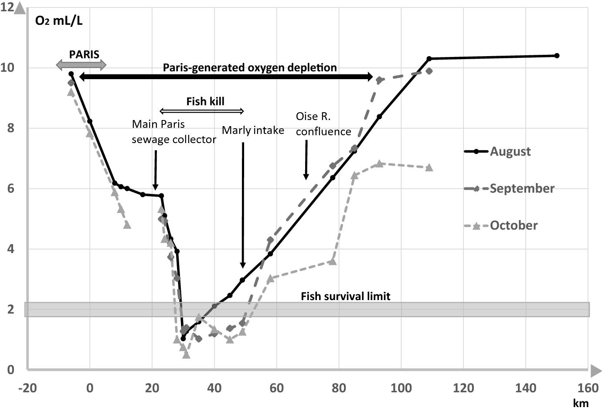

```{julia}
#| output: false
import Pkg
Pkg.activate(@__DIR__)
Pkg.instantiate()
```

```{julia}
#| output: false
using Plots
using Measures
using LaTeXStrings
using Roots

plot_font = "Palatino Roman"
default(
    fontfamily=plot_font,
    linewidth=3,
    framestyle=:box,
    label=nothing,
    grid=false,
    guidefontsize=18,
    legendfontsize=16,
    tickfontsize=16,
    titlefontsize=20,
    bottom_margin=10mm,
    left_margin=5mm
)

# Okabe-Ito palette: distinguishable under all common types of colour
# blindness, and every pair also differs in line style so the figures
# still read in greyscale.
cb_orange = "#E69F00"
cb_green = "#009E73"
cb_yellow = "#F0E442"
cb_blue = "#0072B2"
cb_vermillion = "#D55E00"
cb_purple = "#CC79A7"
```

# Review of Last Class

## Numerical Solutions Are Samples on a Grid

Track the state at a sequence of times $t_0, t_1, t_2, \ldots$ and use the model to advance from one to the next:

$$X(t + \Delta t) = X(t) + \underbrace{\Delta X_t}_{\text{derived from } dX/dt}$$

::: {.fragment .fade-in}
The grid is a **choice we make**, not a property of the system. Everything we report is read off those samples.
:::

## Forward Euler Is First Order

Evaluate the rate at the state we already know:

$$\bbox[5pt, border: 3px solid red]{X(t+\Delta t) = X(t) + \Delta t\, f\left(X(t)\right)}$$

::: {.incremental}
- Local error per step is $O(\Delta t^2)$; we take $T/\Delta t$ steps, so **global error is $O(\Delta t)$**.
- Practically: **halve $\Delta t$, halve the error.**
- On log-log axes, the **slope** of error against $\Delta t$ *is* that order.
:::

## How We Justified a Step Size

:::: {.columns}
::: {.column width=50%}
**Where to start**

The characteristic timescale $1/|\text{rate}|$ of the fastest process in the model. $\Delta t$ must sit well inside it.
:::
::: {.column width=50%}
**When to stop**

Name a scalar **quantity of interest**, halve $\Delta t$ until it stops moving, and report what that changed.
:::
::::

::: {.fragment .fade-in}
Neither step is optional: the timescale tells you where to begin, the refinement tells you when you are done.
:::

## Questions?



# Modeling Dissolved Oxygen

## Dissolved Oxygen

:::: {.columns}
::: {.column width=50%}
Dissolved oxygen (DO) is the free, non-compound oxygen present in water.

Freshwater can only hold small amounts, and this capacity is regulated by temperature.
:::
::: {.column width=50%}
{width=80%}

::: {.caption}
Source: [fondriest.com](https://www.fondriest.com/environmental-measurements/parameters/water-quality/dissolved-oxygen/)
:::
:::
::::

## Dissolved Oxygen and Life

:::: {.columns}
::: {.column width=45%}
DO is essential for aquatic life.

**Hypoxia** occurs when DO levels are $< 2$ mg/L.
:::
::: {.column width=45%}
{width=45%}

::: {.caption}
Source: [fondriest.com](https://www.fondriest.com/environmental-measurements/parameters/water-quality/dissolved-oxygen/)
:::
:::
::::

## Impact of Paris on Seine DO, 1874



::: {.caption}
Source: Dmitrieva, T., et al. (2018). <https://doi.org/10.1007/s12685-018-0216-7>
:::

## DO Regulatory Standards

**Objective**: Keep DO *above* the regulatory standard.

In NY (via [Westlaw](https://govt.westlaw.com/nycrr/Document/I4ed90412cd1711dda432a117e6e0f345?viewType=FullText&originationContext=documenttoc&transitionType=CategoryPageItem&contextData=(sc.Default)&bhcp=1)):

- DO levels may not fall below 3 mg/L
- DO may not be below 4.8 mg/L for an extended period


## Oxygen Balance in Rivers and Streams

{height=100%}

## Biochemical Oxygen Demand (BOD)

Oxygen used by microbes during aerobic decomposition of organic matter:
$$\text{Organic Matter} + \text{O}_2 \rightarrow \text{CO}_2 + \text{H}_2\text{O} + \text{NO}_3 + \text{SO}_2 + \text{Residuals}$$

We track two kinds: **Carbonaceous BOD (CBOD)** from carbon compounds, and **Nitrogenous BOD (NBOD)** from nitrogen compounds.

## Modeling DO

:::: {.columns}
::: {.column width=40%}
We track the mass balance **in terms of rates**, following an element of water as it moves downstream.
:::
::: {.column width=60%}

:::
::::

## DO Mass Balance

Let $U$ be the river velocity (km/d), $x$ the distance downstream from a release site, and $C(x)$ the DO concentration at $x$ (mg/L):

$$\begin{aligned}
U\frac{dC}{dx} &= \Delta\ \text{DO} = \text{Reaeration} + \text{Photosynthesis} - \text{Respiration} \\
&\qquad - \text{Benthal Uptake} - \text{CBOD} - \text{NBOD}
\end{aligned}$$


## BOD Oxygen Uptake

Deoxygenation from waste decomposition is first-order. In time: $M = M_0 e^{-kt}$.

Our equation is in distance, so substitute $t = x/U$:

$$B(x) = B_0 e^{-k_c x/U} \qquad\qquad N(x) = N_0 e^{-k_n x/U}$$

where $k_c$, $k_n$ are the CBOD and NBOD decay rates.

## Putting It Together

Reaeration is proportional to the deficit from saturation, $k_a(C_s - C)$. Photosynthesis ($P$), respiration ($R$), and benthal uptake ($S_B$) are usually measured and treated as constants:

$$\begin{aligned}
U\frac{dC}{dx} &= k_a(C_s - C) + P - R - S_B \\
&\qquad - k_cB_0e^{-k_cx/U} - k_nN_0e^{-k_nx/U}
\end{aligned}$$


# Why Discretize an Equation You Can  Solve?

## Analytic Solution (Streeter-Phelps)

::: {.small-math}
$$\begin{aligned}
C(x) &= C_s(1-\alpha_1) + C_0\alpha_1 - B_0\alpha_2 - N_0\alpha_3 + \left(\frac{P-R-S_B}{k_a}\right)(1-\alpha_1) \\[0.25em]
\alpha_1 &= \exp\left(\frac{-k_ax}{U}\right) \\[0.25em]
\alpha_2 &= \left(\frac{k_c}{k_a-k_c}\right)\left[\exp\left(\frac{-k_cx}{U}\right) - \exp\left(\frac{-k_ax}{U}\right)\right] \\[0.25em]
\alpha_3 &= \left(\frac{k_n}{k_a-k_n}\right)\left[\exp\left(\frac{-k_nx}{U}\right) - \exp\left(\frac{-k_ax}{U}\right)\right]
\end{aligned}$$
:::

[Derivation in the appendix](#sp-solution).

## What Assumptions Did We Make?

::: {.incremental}
- $U$, $k_a$, $k_c$, $k_n$ are **constant** along the whole reach.
- $P$, $R$, $S_B$ are constant (often zero).
- A single, steady release at $x = 0$.
:::


## Two Reasons to Discretize Anyway

1. **One solver, any model**: each closed form is bespoke to its own assumptions --- this one even divides by $k_a - k_c$ and $k_a - k_n$, so equal rates need a separate formula ([appendix](#sp-solution)). Change the kinetics and you re-derive from scratch. Forward Euler does not care.
2. **Conditions change as a parcel travels** --- temperature driving $k_a$ through the day, a flow wave changing $U$, or dispersion mixing neighbouring parcels. Then no single closed form covers the trip. But be careful of numerical errors and computational complexity.


## When Don't You Need To Discretize


- **Multiple discharges**: chain closed-form segments end to end, using one segment's output as the next segment's inlet condition. No discretization needed.
- **A $B_0$ that varies over time**: each parcel still meets constant conditions on its way down, so it gets the same closed form --- just started from the load released when *it* left.

## Discretizing Anyway

## Numerical Solution

**What is the discretized version of the DO ODE?**

::: {.small-math}
$$
\begin{aligned}
C(x + \Delta x) &= C(x) + \frac{\Delta x}{U}\Bigl[k_a (C_s - C(x)) + P - R - S_B \\
&\quad - k_cB_0\exp\left(\frac{-k_cx}{U}\right) - k_n N_0\exp\left(\frac{-k_nx}{U}\right)\Bigr]
\end{aligned}
$$
:::

## Code for Discretized Model

```{julia}
#| echo: true
#| code-fold: false
#| output: false

sp_params = let
    ka, kc, kn = 0.6, 0.4, 0.25    # reaeration, CBOD decay, NBOD decay   [1/d]
    B0, N0 = 9.0, 7.0               # initial CBOD, NBOD                  [mg/L]
    Cs, U = 7.0, 5.0                 # saturation DO [mg/L], velocity [km/d]
    (; ka, kc, kn, B0, N0, Cs, U)
end
C0 = 6.2   # initial DO deficit-state [mg/L] -- a scenario choice, not a model constant

do_change(C, x, params) =
    (params.ka * (params.Cs - C) - params.kc * params.B0 * exp(-params.kc * x / params.U)
     - params.kn * params.N0 * exp(-params.kn * x / params.U)) / params.U

function simulate_do(C_ic, L, Δx, params)
    steps = Int(round(L / Δx))
    C = zeros(steps + 1)
    C[1] = C_ic
    for i in 1:steps
        C[i+1] = C[i] + Δx * do_change(C[i], (i - 1) * Δx, params)
    end
    return C
end
```


## The Sag Curve

```{julia}
#| label: fig-sagcurve
#| fig-cap: "The DO sag curve: forward Euler in x against a fine reference."
#| echo: true
#| code-fold: true

L = 40.0
p_sag = plot(xlabel="Distance downstream  [km]", ylabel="DO  [mg/L]", legend=:bottomright)
plot!(p_sag, 0:0.002:L, simulate_do(C0, L, 0.002, sp_params), color=:black,
    linewidth=5, label="reference (Δx = 0.002)")
for (Δx, col) in zip([2.0, 1.0, 0.5], [cb_vermillion, cb_orange, cb_blue])
    plot!(p_sag, 0:Δx:L, simulate_do(C0, L, Δx, sp_params), color=col,
        linewidth=3, linestyle=:dash, markershape=:circle, markersize=4, label="Δx = $Δx")
end
hline!(p_sag, [2.5], color=cb_green, linewidth=3, linestyle=:dot, label="standard: 2.5 mg/L")
plot!(p_sag, size=(1100, 450), left_margin=12mm, right_margin=8mm,
    bottom_margin=12mm, top_margin=5mm)
```


## Why Is There a Sag At All?

```{julia}
#| label: fig-sag-components
#| fig-cap: "The closed-form solution is a sum: a monotone recovery plus two transient drawdowns."
#| echo: true
#| code-fold: true

# The closed-form solution is a sum of three pieces. Write each one out
# separately so we can plot them.

# Reaeration acting alone: DO relaxes from its starting value toward
# saturation. This piece only ever rises.
function reaeration_only(distance, params)
    reaeration = exp(-params.ka * distance / params.U)
    return params.Cs * (1 - reaeration) + C0 * reaeration
end

# Oxygen consumed by carbonaceous BOD. It is zero at the effluent (no time to
# act yet) and returns to zero once the CBOD is used up, so it must dip in
# between.
function cbod_drawdown(distance, params)
    reaeration = exp(-params.ka * distance / params.U)
    cbod_left  = exp(-params.kc * distance / params.U)
    return -params.B0 * (params.kc / (params.ka - params.kc)) * (cbod_left - reaeration)
end

# Same shape for nitrogenous BOD, but slower and shallower.
function nbod_drawdown(distance, params)
    reaeration = exp(-params.ka * distance / params.U)
    nbod_left  = exp(-params.kn * distance / params.U)
    return -params.N0 * (params.kn / (params.ka - params.kn)) * (nbod_left - reaeration)
end

distances     = 0:0.05:L
recovery_part = [reaeration_only(x, sp_params) for x in distances]
cbod_part     = [cbod_drawdown(x, sp_params) for x in distances]
nbod_part     = [nbod_drawdown(x, sp_params) for x in distances]
total_DO      = [recovery_part[i] + cbod_part[i] + nbod_part[i] for i in 1:length(distances)]

critical_point = distances[argmin(total_DO)]

p_comp = plot(xlabel="Distance downstream  [km]", ylabel="Contribution to DO  [mg/L]",
    legend=:outerright, ylims=(-4, 8))
hline!(p_comp, [0], color=:grey, linewidth=1, label=nothing)
plot!(p_comp, distances, recovery_part, color=cb_blue, linewidth=3,
    linestyle=:dash, label="reaeration alone")
plot!(p_comp, distances, cbod_part, color=cb_vermillion, linewidth=3,
    linestyle=:dashdot, label="CBOD drawdown")
plot!(p_comp, distances, nbod_part, color=cb_orange, linewidth=3,
    linestyle=:dot, label="NBOD drawdown")
plot!(p_comp, distances, total_DO, color=:black, linewidth=5, label="sum = DO")
vline!(p_comp, [critical_point], color=:grey, linewidth=2, linestyle=:dot, label=nothing)
annotate!(p_comp, critical_point + 1.0, -3.2,
    text("critical point\n$(round(critical_point, digits=1)) km", 14, :left))
plot!(p_comp, size=(1100, 450), left_margin=12mm, right_margin=8mm,
    bottom_margin=12mm, top_margin=5mm)
```

## Impact of Step Size

| $\Delta x$ (km) | minimum DO (mg/L) | 
|---:|---:|
| $4.0$ | $1.3$ | 
| $2.0$ | $2.0$ | 
| $1.0$ | $2.3$ | 
| $0.5$ | $2.4$ | 
| $0.25$ | $2.5$ |
| $0.125$ | $2.5$ |


## Does It Converge at First Order?

```{julia}
#| label: fig-do-convergence
#| fig-cap: "Error in the minimum DO against step size, on log-log axes."
#| echo: true
#| code-fold: true

Δxs = [4.0, 2.0, 1.0, 0.5, 0.25, 0.125, 0.0625]
min_ref = minimum(simulate_do(C0, L, 0.001, sp_params))
errs = [abs(minimum(simulate_do(C0, L, Δx, sp_params)) - min_ref) for Δx in Δxs]
orders = [round(log2(errs[i] / errs[i+1]), digits=2) for i in 1:length(errs)-1]

p_doconv = plot(Δxs, errs, xscale=:log10, yscale=:log10, markershape=:circle,
    markersize=7, color=cb_vermillion, linewidth=3, label="forward Euler",
    xlabel="Δx  [km]", ylabel="error in minimum DO  [mg/L]", legend=:bottomright)
plot!(p_doconv, Δxs, errs[1] .* (Δxs ./ Δxs[1]), color=:black, linewidth=2,
    linestyle=:dash, label="slope 1")
plot!(p_doconv, size=(1000, 430), left_margin=12mm, right_margin=8mm,
    bottom_margin=12mm, top_margin=5mm)
```


# Multiple Discharges

## Three Plants on One River

Each effluent mixes with the river; between effluents the closed form applies unchanged. 

**Note: No discretization needed** --- chain the segments by treating each stretch between each effluent as a "box" with a new initial condition, then using the closed form solution.

## The Combined Sag Curve

```{julia}
#| label: fig-multi-sag
#| fig-cap: "Three discharges in sequence. Only the third reach violates the standard."
#| echo: true
#| code-fold: true


# Conditions in the river upstream of the first plant (clean water)
river_flow = 1.0e5      # m³/d
river_DO   = 6.8        # mg/L
river_CBOD = 0.0        # mg/L
river_NBOD = 0.0        # mg/L

# One entry per plant, in order going downstream
plant_location = [0.0, 18.0, 36.0]      # km
plant_flow     = [1.5e4, 1.5e4, 1.5e4]  # m³/d
plant_DO       = [1.0, 1.0, 1.0]        # mg/L
plant_CBOD     = [55.0, 50.0, 65.0]     # mg/L
plant_NBOD     = [33.0, 30.0, 39.0]     # mg/L

# Streeter-Phelps: DO after travelling `distance` down a stretch that begins
# with the given DO, CBOD, and NBOD.
function do_downstream(distance, DO_start, CBOD_start, NBOD_start, params)
    reaeration = exp(-params.ka * distance / params.U)
    cbod_left  = exp(-params.kc * distance / params.U)
    nbod_left  = exp(-params.kn * distance / params.U)

    recovery = params.Cs * (1 - reaeration) + DO_start * reaeration
    cbod_sag = CBOD_start * (params.kc / (params.ka - params.kc)) * (cbod_left - reaeration)
    nbod_sag = NBOD_start * (params.kn / (params.ka - params.kn)) * (nbod_left - reaeration)

    return recovery - cbod_sag - nbod_sag
end

# Each stretch below a plant is a "box": mix the effluent in to get the box's
# starting condition, then apply the closed form within the box.
function simulate_river(x_grid, location, flow, effluent_DO, effluent_CBOD, effluent_NBOD, params)
    DO = zeros(length(x_grid))

    # State of the water entering the current box
    current_flow = river_flow
    DO_in   = river_DO
    CBOD_in = river_CBOD
    NBOD_in = river_NBOD

    # Water upstream of the first plant is clean, so it relaxes toward saturation
    for i in 1:length(x_grid)
        if x_grid[i] < location[1]
            DO[i] = do_downstream(x_grid[i] - x_grid[1], river_DO, river_CBOD, river_NBOD, params)
        end
    end

    # Carry the clean river down to the first plant
    distance = location[1] - x_grid[1]
    DO_in   = do_downstream(distance, DO_in, CBOD_in, NBOD_in, params)
    CBOD_in = CBOD_in * exp(-params.kc * distance / params.U)
    NBOD_in = NBOD_in * exp(-params.kn * distance / params.U)

    for plant in 1:length(location)
        # Carry the river from the previous plant down to this one
        if plant > 1
            distance = location[plant] - location[plant-1]
            DO_in   = do_downstream(distance, DO_in, CBOD_in, NBOD_in, params)
            CBOD_in = CBOD_in * exp(-params.kc * distance / params.U)
            NBOD_in = NBOD_in * exp(-params.kn * distance / params.U)
        end

        # Mix this plant's effluent in. Flow-weighted, so a bigger river dilutes more.
        total_flow = current_flow + flow[plant]
        DO_in   = (current_flow * DO_in   + flow[plant] * effluent_DO[plant])   / total_flow
        CBOD_in = (current_flow * CBOD_in + flow[plant] * effluent_CBOD[plant]) / total_flow
        NBOD_in = (current_flow * NBOD_in + flow[plant] * effluent_NBOD[plant]) / total_flow
        current_flow = total_flow

        # This box runs from this plant to the next one (or to the end)
        if plant < length(location)
            box_end = location[plant+1]
        else
            box_end = maximum(x_grid) + 1.0
        end

        for i in 1:length(x_grid)
            if location[plant] <= x_grid[i] < box_end
                distance_into_box = x_grid[i] - location[plant]
                DO[i] = do_downstream(distance_into_box, DO_in, CBOD_in, NBOD_in, params)
            end
        end
    end

    return DO
end

x_grid = 0:0.02:70
DO_combined = simulate_river(x_grid, plant_location, plant_flow,
                             plant_DO, plant_CBOD, plant_NBOD, sp_params)

p_multi = plot(xlabel="Distance downstream  [km]", ylabel="DO  [mg/L]",
    legend=:topright, ylims=(1.5, 7))
plot!(p_multi, x_grid, DO_combined, color=:black, linewidth=5, label="DO")
hline!(p_multi, [2.5], color=cb_green, linewidth=3, linestyle=:dot, label="standard: 2.5 mg/L")
for plant in 1:length(plant_location)
    vline!(p_multi, [plant_location[plant]], color=cb_vermillion, linewidth=2,
        linestyle=:dash, label=nothing)
    annotate!(p_multi, plant_location[plant] + 0.7, 6.7,
        text("Effluent $plant", 13, cb_vermillion, :left))
end
plot!(p_multi, size=(1200, 500))
```


## Who Is Responsible?

Run each plant **alone** on the clean river, changing nothing else:

| Plant | CBOD load | Minimum DO, alone | Minimum DO, in sequence |
|:--|--:|--:|--:|
| 1 | 55 mg/L | 3.64 | 3.64 |
| 2 | 50 mg/L | 3.97 | 2.64 |
| 3 | 65 mg/L | 3.14 | **2.05** |


# Time-Varying Loading

## A Plant on a Daily Cycle

:::: {.columns}
::: {.column width=40%}
Plant load is not constant --- it typically peaks with morning and evening flows.

We simplify to **one** cycle a day: CBOD swinging $\pm 40\%$, everything else fixed.
:::
::: {.column width=60%}
```{julia}
#| label: fig-cbod-diurnal
#| fig-cap: "CBOD leaving the effluent over one day. Marked times are followed downstream next."
#| echo: true
#| code-fold: true

# The load is a function of clock time, not of grid index, so refining the
# grid cannot silently change the scenario.
B_diurnal(τ) = sp_params.B0 * (1 + 0.4 * sin(2π * τ))   # τ in days

# Three times of day we will follow downstream on the next slide
parcel_start = [0.0, 0.25, 0.75]                        # days: mean, peak, trough
parcel_color = [cb_blue, cb_orange, cb_purple]

hours = 0:0.1:24
CBOD_released = [B_diurnal(h / 24) for h in hours]

p_load = plot(hours, CBOD_released, color=cb_green, linewidth=3,
    xlabel="Time of day  [h]", ylabel="CBOD  [mg/L]",
    legend=false, xticks=0:6:24)
hline!(p_load, [sp_params.B0], color=:black, linewidth=2, linestyle=:dash)
for i in 1:length(parcel_start)
    scatter!(p_load, [parcel_start[i] * 24], [B_diurnal(parcel_start[i])],
        color=parcel_color[i], markersize=9, markerstrokewidth=0)
end
plot!(p_load, size=(620, 420), left_margin=10mm, bottom_margin=10mm)
```
:::
::::

## Following One Parcel Downstream

A parcel picks up the load the plant is releasing at the moment it leaves, then carries **that** load the whole way down.

```{julia}
#| label: fig-do-parcel
#| fig-cap: "Three parcels leaving the effluent at different points in the daily cycle."
#| echo: true
#| code-fold: true

# Follow one parcel. Its CBOD is fixed when it leaves, so the closed form
# applies to it unchanged.
function do_along_parcel(departure_time, distance, params)
    CBOD_carried = B_diurnal(departure_time)
    return do_downstream(distance, C0, CBOD_carried, params.N0, params)
end

xd = 0:0.02:L

p_parcel = plot(xlabel="Distance downstream  [km]", ylabel="DO  [mg/L]",
    legend=:outerright, ylims=(1.2, 7))
for i in 1:length(parcel_start)
    DO_parcel = [do_along_parcel(parcel_start[i], x, sp_params) for x in xd]
    plot!(p_parcel, xd, DO_parcel, color=parcel_color[i], linewidth=2.5,
        label="left at $(Int(round(parcel_start[i] * 24))) h")
end
hline!(p_parcel, [2.5], color=cb_green, linewidth=3, linestyle=:dot, label="standard")
plot!(p_parcel, size=(1200, 350), left_margin=10mm)
```


## River Snapshot

:::: {.columns}
::: {.column width=50%}
Survey the whole river at some clock time and you see something else (the parcel at $x$ left the effluent at $\tau = t - x/U$):
:::
::: {.column width=50%}
```{julia}
#| label: fig-do-diurnal
#| fig-cap: "Snapshots through one day, against the steady profile at the mean load."
#| echo: true
#| code-fold: true

do_snapshot(t, x, params) = do_downstream(x, C0, B_diurnal(t - x / params.U), params.N0, params)

snapshot_time = [0.0, 0.25, 0.5, 0.75]                  # days
snapshot_color = [cb_blue, cb_orange, cb_purple, cb_vermillion]

p_diel = plot(xlabel="Distance downstream  [km]", ylabel="DO  [mg/L]",
    legend=:outerbottom, legend_columns=2, ylims=(1.2, 7))
for i in 1:length(snapshot_time)
    DO_snapshot = [do_snapshot(snapshot_time[i], x, sp_params) for x in xd]
    plot!(p_diel, xd, DO_snapshot, color=snapshot_color[i],
        linewidth=2.5, label="t = $(Int(round(snapshot_time[i] * 24))) h")
end
plot!(p_diel, xd, [do_downstream(x, C0, sp_params.B0, sp_params.N0, sp_params) for x in xd],
    color=:black, linewidth=5, linestyle=:dash, label="steady, mean load")
hline!(p_diel, [2.5], color=cb_green, linewidth=3, linestyle=:dot, label="standard")
plot!(p_diel, size=(600, 600), left_margin=10mm, bottom_margin=0mm)
```
:::
::::

## Averaging the Load Hides the "True" Minimum

- DO is *linear* in $B_0$, so the **time-averaged DO** does match the steady-state DO at the mean load.
- But `minimum` is **not** a linear operator: the worst moment is not the average moment.
- The standard regulates the extreme, so the averaged calculation answers the wrong question.

# Key Takeaways and Upcoming Schedule

## Key Takeaways

- The DO **sag curve** has a minimum downstream of the release --- the regulated quantity is not the endpoint or the point of emissions.
- The closed-form Streeter-Phelps solution divides by $k_a - k_c$ and $k_a - k_n$, and assumes every rate is constant along the river --- reasons to possibly discretize.
- Discretizing buys you **generality**.

## Next Classes

**Monday**: Lab 1 --- convergence of discretized simulation models.

**Wednesday**: Monte Carlo

## Assessments

**Homework 2**: Due tomorrow at 9pm.

**Homework 3**: Assigned Friday, due Thursday, September 24.

# Appendix

## Streeter-Phelps Solution {#sp-solution}

Assuming we have known solutions for $B$ and $N$:.

Writing rates per km, $a = k_a/U$, $c = k_c/U$, $n = k_n/U$, and $S = (P-R-S_B)/U$:

$$\begin{gathered}
U\frac{dC}{dx} = k_a(C_s - C) + P - R - S_B - k_cB_0e^{-k_cx/U} - k_nN_0e^{-k_nx/U} \\[0.5em]
\Rightarrow \frac{dC}{dx} + aC = aC_s + S - cB_0e^{-cx} - nN_0e^{-nx}
\end{gathered}$$

## Streeter-Phelps Solution

Multiply by the integrating factor $\mu = e^{ax}$. The left side collapses into a single derivative:

\begin{aligned}
\frac{d}{dx}\left(Ce^{ax}\right) &= aC_se^{ax} + Se^{ax} - cB_0e^{(a-c)x} - nN_0e^{(a-n)x}
\end{aligned}

Every term on the right is now a bare exponential.

## Streeter-Phelps Solution

Integrate from $0$ to $x$, with $C(0) = C_0$:

::: {.small-math}
\begin{aligned}
Ce^{ax} - C_0 &= C_s\left(e^{ax}-1\right) + \frac{S}{a}\left(e^{ax}-1\right) \\[0.5em]
&\quad - \frac{cB_0}{a-c}\left(e^{(a-c)x}-1\right) - \frac{nN_0}{a-n}\left(e^{(a-n)x}-1\right)
\end{aligned}
:::

## Streeter-Phelps Solution

Multiply through by $e^{-ax}$:

::: {.small-math}
\begin{aligned}
C(x) &= C_0e^{-ax} + \left(C_s + \frac{S}{a}\right)\left(1-e^{-ax}\right) \\[0.5em]
&\quad - \frac{cB_0}{a-c}\left(e^{-cx}-e^{-ax}\right) - \frac{nN_0}{a-n}\left(e^{-nx}-e^{-ax}\right)
\end{aligned}
:::

The $U$s cancel in every ratio --- $\frac{c}{a-c} = \frac{k_c}{k_a-k_c}$ and $\frac{S}{a} = \frac{P-R-S_B}{k_a}$ --- which is the $\alpha_1, \alpha_2, \alpha_3$ form.

## When $k_a = k_c$

At $a = c$ the third integral is $\int_0^x ds = x$, not $\left(e^{(a-c)x}-1\right)/(a-c)$. Only that term changes:

$$-B_0\left(\frac{k_cx}{U}\right)e^{-k_ax/U}$$

The singularity is **removable**: the formula fails, not the solution.

Near-equality is harmless --- the relative error stays under $10^{-9}$ for $k_a - k_c \geq 10^{-7}$/d. This is a case to code around, not a modeling limitation.

# References

## References
