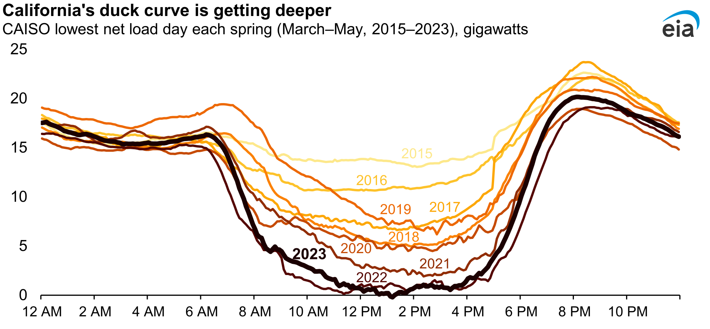

```{julia}
#| output: false
import Pkg
Pkg.activate(@__DIR__)
Pkg.instantiate()
```

```{julia}
#| output: false
using Plots
using StatsPlots
using Measures
using LaTeXStrings
using JuMP
using HiGHS
using CSV
using DataFrames

plot_font = "Palatino Roman"
default(
    fontfamily=plot_font,
    linewidth=3,
    framestyle=:box,
    label=nothing,
    grid=false,
    guidefontsize=18,
    legendfontsize=16,
    tickfontsize=16,
    titlefontsize=20,
    bottom_margin=10mm,
    left_margin=5mm
)

# Okabe-Ito palette: distinguishable under all common types of colour
# blindness, and every pair also differs in line style so the figures
# still read in greyscale.
cb_orange = "#E69F00"
cb_green = "#009E73"
cb_yellow = "#F0E442"
cb_blue = "#0072B2"
cb_vermillion = "#D55E00"
cb_purple = "#CC79A7"
cb_sky = "#56B4E9"

# Whole numbers with thousands separators, for dollar amounts in text
commas(n) = replace(string(Int(round(n))), r"(?<=\d)(?=(\d{3})+$)" => ",")
```

```{julia}
#| output: false

# The fleet: 13 thermal and hydro plants, plus wind and solar (used in the multi-period part)
gens = DataFrame(CSV.File("data/economic_dispatch/generators.csv"))
n_thermal = nrow(gens) - 2          # every plant except wind and solar
thermal = 1:n_thermal
demand_mw = 1600                    # one hour's demand [MW]
```

# Review and Questions

## Shadow Prices

A **shadow price** is the change in the objective when a constraint is relaxed by one unit (October 19).

On the emissions problem, relaxing the standard at receptor B by 1 µg/m³ would have saved about \$2,150 per year.

Today the same idea gives us the **price of electricity**.

::: {.notes}
Substitute's sheet for this lecture.

Timing (75 minutes): review by minute 4; power-system overview by minute 10; single-period dispatch by minute 22; prices by minute 38; multi-period dispatch by minute 60; duck curve by minute 70; takeaways and logistics to 75.

If you are running short, cut in this order: (1) the "Doubling the Solar Capacity" slide (keep the EIA duck curve); (2) the must-run minimum fragment on "What Is Capacity Worth?"; (3) the multi-period results area plot; (4) the variable-cost note.

The one sentence about signs to say aloud: JuMP reports what relaxing a constraint by one unit does to the cost. For the demand constraint, relaxing means serving one less megawatt-hour, so the cost falls and the shadow price is negative.

Key numbers: at 1600 MW the price is \$38/MWh, set by the gas combustion turbine CT1. Hydro's capacity shadow price is −38 and CCGT4's is −2.

Students have Mini-Project 2 assigned today and Quiz 4 next Wednesday. Mini-Project 2 asks them to sweep a carbon tax themselves, so don't compute carbon-price effects in class beyond the one bullet on the merit-order slide.

Say for this slide: the definition is the one from October 19. The \$2,150 number is from the two-stack emissions problem students solved by hand and in JuMP.
:::

## Questions?



::: {.notes}
Take one or two questions about the October 19 material or the Oct 26 JuMP lab. If there are none, move on.
:::

# Electric Power System Decision Problems

## Overview of Electric Power Systems


::: {.caption}
Source: [Wikipedia](https://en.wikipedia.org/wiki/Electric_power_transmission)
:::

::: {.notes}
You should be here by minute 4. Walk through the chain: generation, step-up transformers, high-voltage transmission, substations, distribution, customers. Today is about the first box: which plants generate, and how much, to meet the load at each moment.
:::

## Decision Problems for Power Systems


::: {.caption}
Adapted from Perez-Arriaga, Ignacio J., Hugh Rudnick, and Michel Rivier (2009)
:::

::: {.notes}
Decisions sit on different time scales: what to build (years; that is Monday's capacity expansion), which plants to commit (a day ahead), and how much each running plant generates (hours to minutes; that is economic dispatch, today). The same LP tools show up at every scale.
:::

## Electricity Generation by Source


::: {.notes}
The US mix: natural gas is the largest source, then nuclear, coal and renewables. Gas plants come in two kinds that matter today: efficient combined-cycle plants (CCGT) that run for long stretches, and cheaper-to-build but more expensive-to-run combustion turbines (CT) that run only when needed.
:::

# Single-Period Economic Dispatch

## Economic Dispatch

**Decision problem**: how much should each running plant produce to meet demand at lowest cost?

::: {.fragment .fade-in}
| Variable | Meaning |
|:-----:|:---------------|
| $d$ | demand this hour (MW) |
| $y_g$ | generation of plant $g$ (MW) |
| $\text{VarCost}_g$ | variable cost of plant $g$ (\$/MWh) |
| $P^{\text{min/max}}_g$ | minimum and maximum output of $g$ (MW) |
:::

::: {.notes}
You should be here by minute 10. Ask the room what the decision variables are before revealing the table. The answer: one generation level per plant. Demand, costs and limits are data. Plants also face engineering constraints we ignored in capacity planning: minimum outputs, ramping limits, and in real systems transmission limits, which we leave out.
:::

## Where Variable Costs Come From

:::: {.columns}
::: {.column width=55%}
- labor and equipment upkeep;
- **fuel** (the big one), converted to \$/MWh by the plant's efficiency, its **heat rate**.

Cost curves are really slightly *quadratic*; we use a linear (or piecewise linear) approximation.
:::
::: {.column width=45%}


::: {.caption}
Source: [Ross Baldick, UT Austin](https://users.ece.utexas.edu/~baldick/classes/394V/Dispatch.pdf)
:::
:::
::::

::: {.notes}
The heat rate is how much fuel energy a plant burns per MWh of electricity. A plant with a lower heat rate (more efficient) has a lower variable cost for the same fuel price. The curve on the right bends upward because efficiency changes with output; a linear approximation is good enough for dispatch over the normal operating range.
:::

## The Single-Period Problem

Write the economic dispatch problem for one hour.

::: {.fragment .fade-in}
$$
\begin{aligned}
\min_{y} \quad & \sum_{g \in \mathcal{G}} \text{VarCost}_g \, y_g \\
\text{subject to:} \quad & \sum_{g \in \mathcal{G}} y_g = d \\[0.3em]
& y_g \leq P^{\text{max}}_g \qquad \forall g \in \mathcal{G} \\[0.3em]
& y_g \geq P^{\text{min}}_g \qquad \forall g \in \mathcal{G}
\end{aligned}
$$
:::

::: {.notes}
Board item; the answer is the fragment, so no board is needed. Give students a minute to write it, then reveal. Points to make: there is one demand constraint (a single sum over all plants, not one per plant). Generation must equal demand: we can't store electricity. Each plant has its own capacity and minimum-output constraint. Everything is linear, so it is an LP.
:::

## Example: The Fleet

```{julia}
#| echo: true
#| code-fold: true
#| output: asis

# Summarise the fleet by type: how many plants, their capacity and cost ranges
for resource in unique(gens[thermal, :Resource])
    rows = gens[thermal, :][gens[thermal, :Resource] .== resource, :]
    n_plants = nrow(rows)
    smallest, largest = extrema(rows.Pmax)
    cheapest, dearest = extrema(rows.VarCost)
    if smallest == largest
        cap_text = "$(smallest) MW"
    else
        cap_text = "$(smallest)–$(largest) MW"
    end
    if cheapest == dearest
        cost_text = "\\\$$(cheapest)/MWh"
    else
        cost_text = "\\\$$(cheapest)–$(dearest)/MWh"
    end
    println("- $(n_plants) $(resource): $(cap_text) capacity, $(cost_text)")
end
```

Demand this hour: **`{julia} demand_mw` MW**.

::: {.notes}
Four combined-cycle gas plants (CCGT) and seven combustion turbines (CT), plus a biomass and a hydro plant. Hydro is cheapest to run because the water is free. CTs are the most expensive per MWh. Several gas plants have minimum outputs: once on, they must produce at least that much.
:::

# Prices From the Dispatch

## Single-Period Results

```{julia}
#| echo: true
#| code-fold: true

dispatch = Model(HiGHS.Optimizer)
@variable(dispatch, y[g in 1:n_thermal] >= 0)
@objective(dispatch, Min, sum(gens[g, :VarCost] * y[g] for g in 1:n_thermal))
@constraint(dispatch, load, sum(y) == demand_mw)
@constraint(dispatch, capacity[g in 1:n_thermal], y[g] <= gens[g, :Pmax])
@constraint(dispatch, minimum_output[g in 1:n_thermal], y[g] >= gens[g, :Pmin])
set_silent(dispatch)
optimize!(dispatch)

output = value.(y)
p_results = bar(gens[thermal, :Plant], output, color=cb_blue, label="dispatched",
    xrotation=45, ylabel="Generation  [MW]", legend=:topright)
scatter!(p_results, gens[thermal, :Plant], gens[thermal, :Pmax], markershape=:hline,
    markersize=18, markerstrokewidth=4, color=:black, label="capacity")
scatter!(p_results, gens[thermal, :Plant], gens[thermal, :Pmin], markershape=:hline,
    markersize=18, markerstrokewidth=4, color=cb_vermillion, label="minimum")
plot!(p_results, size=(1200, 460), bottom_margin=22mm, left_margin=12mm)
```

::: {.notes}
Bars are what each plant produces; black ticks are capacities and red ticks are minimum outputs. Read the pattern: the cheap plants (hydro, biomass, the efficient CCGTs) are at capacity. CT1 is partly loaded. CT2 to CT4 sit at their minimums. CT5 to CT7 are off. The total is `{julia} demand_mw` MW at a cost of \$`{julia} commas(objective_value(dispatch))` for the hour.
:::

## The Dispatch Stack

```{julia}
#| echo: true
#| code-fold: true

# Minimum outputs first, then each plant's remaining capacity in order of cost
order = sortperm(gens[thermal, :VarCost])
widths = gens[thermal, :Pmax][order] .- gens[thermal, :Pmin][order]
heights = gens[thermal, :VarCost][order]
must_run = sum(gens[thermal, :Pmin])
left_edges = must_run .+ [0; cumsum(widths)[1:end-1]]
marginal = findfirst(left_edges .+ widths .>= demand_mw)
stack_price = heights[marginal]

rectangle(w, h, x) = Shape(x .+ [0, w, w, 0], [0, 0, h, h])
p_stack = plot(rectangle(must_run, 1, 0), color=:gray60, linewidth=0.5,
    xlabel="Cumulative capacity  [MW]", ylabel="Marginal cost  [\$/MWh]",
    xlims=(0, 2100), ylims=(0, 50), xticks=0:500:2000)
for i in eachindex(order)
    if i == marginal
        bar_color = cb_vermillion        # the plant that sets the price
    else
        bar_color = cb_blue
    end
    plot!(p_stack, rectangle(widths[i], max(heights[i], 1), left_edges[i]),
        color=bar_color, alpha=0.6, linewidth=0.5)
end
vline!(p_stack, [demand_mw], color=:black, linestyle=:dash, linewidth=3)
hline!(p_stack, [stack_price], color=cb_vermillion, linestyle=:dot, linewidth=3)
annotate!(p_stack, 300, 4, text("minimum outputs", 14, plot_font))
annotate!(p_stack, demand_mw + 20, 47, text("demand", 16, :left, plot_font))
annotate!(p_stack, 200, stack_price + 2.5, text("price: \$$(stack_price)/MWh", 16, :left, plot_font))
plot!(p_stack, size=(1200, 370), left_margin=12mm, right_margin=6mm)
```

CT1 (red) serves the next MWh, so the price is **\$`{julia} stack_price`/MWh**.

::: {.notes}
This is the merit order: plants stacked from cheapest to most expensive, after the minimum outputs that must run anyway (gray). Demand (dashed line) cuts the stack inside CT1, so CT1 is the marginal plant. If demand rose by one MWh, CT1 would produce it at \$38, so \$38/MWh is the price. Ask: "what happens to the price if demand rises past CT1's capacity?" Answer: the next plant in the stack, CT2 or CT3 at \$39, sets it.
:::

## The Price From JuMP

```{julia}
#| echo: true
#| code-fold: false
#| output: false

price = -shadow_price(load)                 # [$/MWh]
capacity_value = shadow_price.(capacity)    # [$ per MW of capacity, this hour]
```

`shadow_price(load)` is **`{julia} round(Int, shadow_price(load))`**: relaxing demand by one unit means serving one less MWh, which saves \$`{julia} round(Int, price)`.

::: {.fragment .fade-in}
So the price is **\$`{julia} round(Int, price)`/MWh**, the same as the dispatch stack: the cost of the plant that would serve the next MWh.
:::

::: {.notes}
The model is in the folded code on "Single-Period Results": it names the demand constraint `load` and the capacity constraints `capacity`, so JuMP can report their shadow prices. Say the sign sentence: JuMP reports what relaxing a constraint by one unit does to the cost. For demand, relaxing means serving one less MWh, so the cost falls by \$38 and the shadow price is −38. The price of electricity is the size of that number. This is how wholesale markets set prices: the demand constraint's shadow price in the operator's dispatch model.
:::

## What Is Capacity Worth?

```{julia}
#| echo: true
#| code-fold: true

short_names = replace.(gens[thermal, :Plant], "NG " => "", "Hydroelectric" => "Hydro")
p_capvalue = bar(short_names, capacity_value, color=cb_blue, tickfontsize=13,
    ylabel="\$/MW", ylims=(-42, 3))
hline!(p_capvalue, [0], color=:black, linewidth=1)
plot!(p_capvalue, size=(1200, 250), bottom_margin=6mm, left_margin=10mm)
```

::: {.fragment .fade-in}
A full plant's extra MW saves \$`{julia} round(Int, price)` minus its own cost (\$`{julia} round(Int, -capacity_value[2])` at hydro, \$`{julia} round(Int, -capacity_value[6])` at CCGT4). Plants below their limits gain **nothing**.
:::

::: {.notes}
You should be here by about minute 32. Each full plant's capacity is worth the price minus its own marginal cost. Plants that aren't at capacity (CT1, which is the marginal plant, and CT2 to CT7) have zero capacity shadow prices: extra capacity there saves nothing.

Must-run minimums, if time allows: CT2, CT3 and CT4 run at their minimum outputs even though they cost more than the price. Their minimum-output constraints have shadow prices of `{julia} round(Int, shadow_price(minimum_output[8]))`, `{julia} round(Int, shadow_price(minimum_output[9]))` and `{julia} round(Int, shadow_price(minimum_output[10]))`: relaxing a minimum by 1 MW saves \$1 to \$2, the gap between each plant's cost and the price.
:::

## What Complicates the Merit Order?

What could make the cheapest-first rule wrong?

::: {.fragment .fade-in}
- **Minimum outputs**: some plants must run.
- **Ramping limits**: output can change only so fast.
- **Start-up costs**: turning on costs money (Wednesday).
- **Transmission**: cheap power may not reach the load.
- **A carbon price** can reorder the stack (Mini-Project 2).
:::

::: {.notes}
Let students suggest answers for a minute before revealing. The ramping bullet leads into the next section. The carbon-price bullet is the one place today mentions it: Mini-Project 2 asks students to sweep a carbon tax themselves, so don't work an example.
:::

# Multi-Period Dispatch

## Ramping Constraints

Output can change by at most $R_g$ per hour:

::: {.small-math}
$$
\begin{aligned}
\min_{y} \quad & \sum_{g \in \mathcal{G}} \sum_{t \in \mathcal{T}} \text{VarCost}_g \, y_{g,t} \\
\text{subject to:} \quad & \sum_{g \in \mathcal{G}} y_{g,t} = d_t \qquad \forall t \in \mathcal{T} \\[0.3em]
& P^{\text{min}}_g \leq y_{g,t} \leq P^{\text{max}}_g \qquad \forall g, t \\[0.3em]
& \color{#D55E00}{y_{g,t+1} - y_{g,t} \leq R_g} \qquad \forall g, \ t = 1, \ldots, T-1 \\[0.3em]
& \color{#D55E00}{y_{g,t} - y_{g,t+1} \leq R_g} \qquad \forall g, \ t = 1, \ldots, T-1
\end{aligned}
$$
:::

::: {.notes}
You should be here by minute 38. Two ramping constraints per plant per pair of hours: one limits ramping up, the other ramping down. They run from the first hour to the second-to-last, because the last hour has no next hour. These constraints are what couple the hours together: without them, each hour would be its own single-period problem.
:::

## Ramp Limits by Plant Type

```{julia}
#| echo: true
#| code-fold: true
#| output: asis

ramp_share = gens.Ramp ./ gens.Pmax
for resource in unique(gens.Resource)
    shares = ramp_share[gens.Resource .== resource]
    lowest = round(Int, 100 * minimum(shares))
    highest = round(Int, 100 * maximum(shares))
    if lowest == highest
        share_text = "$(lowest)%"
    else
        share_text = "$(lowest)–$(highest)%"
    end
    println("- **$(resource)**: up to $(share_text) of capacity per hour")
end
```

Wind and solar can also ramp quickly, but only as far as the weather allows: their limit each hour is a **capacity factor**.

::: {.notes}
In real fleets ramping differs strongly by technology: nuclear plants run in a narrow band, while combustion turbines can go from zero to full in minutes. Here CCGTs can change by 40% of their capacity per hour, and everything else can ramp fully. Combined with cost, ramping is why some plants are "baseload" and others are "peakers".
:::

## Demand and Renewables, Oct 16, 2020

```{julia}
#| echo: true
#| code-fold: true

NY_demand = DataFrame(CSV.File("data/economic_dispatch/2020_hourly_load_NY.csv"))
day = 289                                   # October 16, 2020
hours = (day * 24 + 1):((day + 1) * 24)
hourly_demand = NY_demand[hours, :C]        # NYISO Zone C [MW]
capacity_factor = DataFrame(CSV.File("data/economic_dispatch/gen_variability.csv"))

p_demand = plot(1:24, hourly_demand, color=:black, xlabel="Hour", ylabel="Demand  [MW]",
    xticks=0:6:24, title="Demand, NYISO Zone C")
p_cf = plot(1:24, capacity_factor.Wind, color=cb_sky, label="wind", xlabel="Hour",
    ylabel="Capacity factor", ylims=(0, 1), xticks=0:6:24, title="Wind and solar")
plot!(p_cf, 1:24, capacity_factor.Solar, color=cb_orange, linestyle=:dash, label="solar")
plot(p_demand, p_cf, layout=(1, 2), size=(1200, 430), left_margin=10mm, bottom_margin=10mm)
```

::: {.notes}
Demand runs from about `{julia} Int(round(minimum(hourly_demand)))` MW overnight to `{julia} Int(round(maximum(hourly_demand)))` MW at the evening peak. The capacity factor is the share of a plant's capacity the weather makes available each hour: solar is zero at night and peaks at midday; wind varies through the day. The fleet has `{julia} gens[end-1, :Pmax]` MW of wind and `{julia} gens[end, :Pmax]` MW of solar.
:::

## Adding Renewables

Wind and solar enter through their capacity factors $c_{g,t}$:

$$y_{g,t} \leq P^{\text{max}}_g \times c_{g,t} \qquad \forall g \in \mathcal{G}, t \in \mathcal{T}$$

Everything else stays the same. Their variable cost is zero, so the dispatch uses all they can give, unless something else stops it.

::: {.notes}
For thermal plants the capacity factor is 1 every hour. "Unless something else stops it" foreshadows the twice-solar case later: when solar plus the plants that must run exceeds demand, some solar is curtailed.
:::

## Multi-Period Results

```{julia}
#| echo: true
#| code-fold: true

n_plants = nrow(gens)
day_hours = 1:24
capacity_factor_matrix = Matrix(capacity_factor[:, 2:end])'   # plants × hours

function solve_day(; ramp=true, solar_scale=1)
    pmax = Float64.(gens.Pmax)
    pmax[end] *= solar_scale                 # the last plant is solar
    model = Model(HiGHS.Optimizer)
    @variable(model, gens[g, :Pmin] <= z[g in 1:n_plants, t in 1:24] <=
        pmax[g] * capacity_factor_matrix[g, t])
    @objective(model, Min, sum(gens[g, :VarCost] * z[g, t] for g in 1:n_plants, t in 1:24))
    @constraint(model, hourly_load[t in 1:24], sum(z[:, t]) == hourly_demand[t])
    if ramp
        @constraint(model, ramp_up[g in 1:n_plants, t in 1:23], z[g, t+1] - z[g, t] <= gens[g, :Ramp])
        @constraint(model, ramp_down[g in 1:n_plants, t in 1:23], z[g, t] - z[g, t+1] <= gens[g, :Ramp])
    end
    set_silent(model)
    optimize!(model)
    prices = [-shadow_price(hourly_load[t]) for t in day_hours]
    return (generation=value.(z), cost=objective_value(model), prices=prices)
end

base_day = solve_day()

# Sum generation by resource type for the area plot
resources = ["Hydroelectric", "Biomass", "Wind", "Solar", "NG CCGT", "NG CT"]
resource_colors = [cb_blue, cb_green, cb_sky, cb_yellow, cb_orange, cb_vermillion]
by_resource = zeros(length(day_hours), length(resources))
for (j, resource) in enumerate(resources)
    by_resource[:, j] = vec(sum(base_day.generation[gens.Resource .== resource, :]; dims=1))
end
areaplot(day_hours, by_resource, label=permutedims(resources), color=permutedims(resource_colors),
    xlabel="Hour", ylabel="Generation  [MW]", legend=:outerright, xticks=0:6:24,
    size=(1200, 460), left_margin=10mm, ylims=(0, 2000))
```

::: {.notes}
You should be here by about minute 52. Hydro, biomass, wind and solar run whenever available; CCGTs carry most of the load; CTs fill in the morning and evening peaks. Solar's midday contribution shows up as a dip in what the gas plants have to provide.
:::

## Hourly Prices

```{julia}
#| echo: true
#| code-fold: true

no_ramp_day = solve_day(ramp=false)
ramp_cost = base_day.cost - no_ramp_day.cost
p_prices = plot(day_hours, base_day.prices, seriestype=:steppost, color=cb_blue,
    label="with ramp limits", xlabel="Hour", ylabel="Price  [\$/MWh]", xticks=0:6:24,
    ylims=(0, 50), legend=:bottomright)
plot!(p_prices, day_hours, no_ramp_day.prices, seriestype=:steppost, color=cb_vermillion,
    linestyle=:dash, label="without ramp limits")
plot!(p_prices, size=(1200, 300), left_margin=10mm)
```

Each hour's price is its demand shadow price: \$`{julia} round(Int, base_day.prices[1])` most hours, \$`{julia} round(Int, maximum(base_day.prices[7:8]))` in the morning, \$`{julia} round(Int, maximum(base_day.prices))` at the evening peak.

::: {.notes}
Prices follow the plant that is marginal each hour. Ramp limits matter in only one hour here: at hour 19 the price is \$`{julia} round(Int, base_day.prices[19])` with ramp limits and \$`{julia} round(Int, no_ramp_day.prices[19])` without, because the CCGTs can't ramp up fast enough and a combustion turbine fills in. Over the whole day, ramp limits add only \$`{julia} commas(ramp_cost)` (`{julia} round(100 * ramp_cost / no_ramp_day.cost; digits=2)`% of the cost). So the point is when prices are high, not that ramping is expensive in total.
:::

# Renewables and the Duck Curve

## Doubling the Solar Capacity

```{julia}
#| echo: true
#| code-fold: true

double_solar_day = solve_day(solar_scale=2)
p_solar = plot(day_hours, base_day.prices, seriestype=:steppost, color=cb_blue,
    label="$(gens[end, :Pmax]) MW solar", xlabel="Hour", ylabel="Price  [\$/MWh]", xticks=0:6:24,
    ylims=(0, 50), legend=:bottomleft)
plot!(p_solar, day_hours, double_solar_day.prices, seriestype=:steppost, color=cb_orange,
    linestyle=:dash, label="$(commas(2 * gens[end, :Pmax])) MW solar")
plot!(p_solar, size=(1200, 300), left_margin=10mm)
```

With twice the solar capacity, midday prices fall to **\$`{julia} round(Int, minimum(double_solar_day.prices))`**; the evening peak stays at **\$`{julia} round(Int, maximum(double_solar_day.prices[18:22]))`**.

::: {.notes}
You should be here by about minute 62. At midday, solar plus the plants that must run at their minimum outputs exceeds demand, so some solar is curtailed and an extra MWh costs nothing: the price is zero. After sunset solar disappears, and the evening peak still needs the same expensive gas plants. Adding solar makes prices swing more within the day; it does not make the evening any cheaper. The same pattern holds for three or four times the solar.
:::

## The "Duck Curve" {.nostretch}

**Net load** is demand minus wind and solar. Who supplies the steep rise at sunset?

{width="820" fig-align="center"}

::: {.caption}
Source: [EIA](https://www.eia.gov/todayinenergy/detail.php?id=56880)
:::

::: {.fragment .fade-in}
Fast but expensive gas turbines, or plants kept on all afternoon.
:::

::: {.notes}
California's net load on its lowest spring day has dropped close to zero at midday in recent years, then climbs by about 20 GW in four or five hours as the sun sets. That evening rise has to come from plants that can ramp quickly. If ramp limits bind, the operator either keeps slower plants online through the afternoon (running at their minimums, which can force solar curtailment, as in our twice-solar case) or relies on fast but expensive combustion turbines. Both raise costs, and without enough ramping capability, demand at sunset may not be met.
:::

# Key Takeaways and Upcoming Schedule

## Key Takeaways

::: {.incremental}
- **Economic dispatch**: run existing plants at least cost (merit order).
- **Price = the demand constraint's shadow price** (\$`{julia} round(Int, price)`/MWh here).
- A full plant's capacity is worth the price minus its own cost.
- **Minimum outputs and ramping** break the merit order.
- More solar makes midday power cheap and the evening ramp steep (the **duck curve**).
:::

::: {.notes}
You should be here by minute 70.
:::

## Next Classes

**Monday, November 2**: Capacity expansion: deciding what to *build*, not just how to run what exists.

**Wednesday, November 4**: Quiz 4, then mixed integer programming.

## Assessments

**Homework 6**: Due tomorrow (Thursday, October 29) at 9pm.

**Mini-Project 2**: Assigned today, due Thursday, November 19.

**Quiz 4**: Wednesday, November 4.
