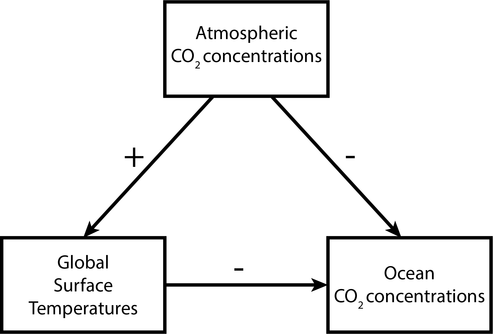
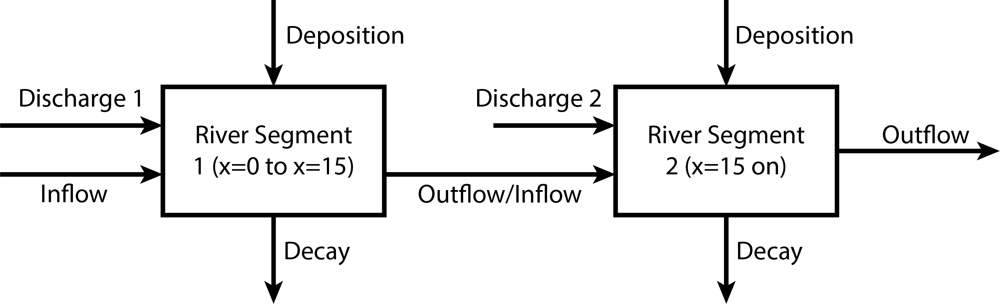

## Overview

### Load Environment

The following code loads the environment and makes sure all needed packages are installed. This should be at the start of most Julia scripts.

```{julia}
#| output: false
import Pkg
Pkg.activate(@__DIR__)
Pkg.instantiate()
```

```{julia}
using Plots
using LaTeXStrings
using CSV
using DataFrames
using Roots
```

## Problems (Total: 30 Points)


### Problem 1 (5 points)

The systems diagram should look like this:



* The positive connection between atmospheric CO~2~ concentrations and global temperatures is just capturing the greenhouse effect: CO~2~ blocks the transmission of radiation along certain frequencies which would normally cause a loss of energy back to space. 
* The negative connection between global temperatures and ocean CO~2~ concentrations is a result of Henry's law for the solubility of CO~2~. While the oceans are not an ideal mixture and the atmospheres and oceans aren't in equilibrium (so one would be cautious in using Henry's law to make specific predictions about concentrations), the key insight is the temperature dependence of Henry's constant, where increasing temperature decreases solubility.
* The negative connection between ocean and atmospheric CO~2~ concentrations^[There is a slight error in the figure: this should ideally be a bidirectional arrow, but both are negative connections] is the result of the mass balance of CO~2~: CO~2~ which degasses from the oceans must end up in the atmosphere, and the uptake of CO~2~ from the oceans must come from the atmosphere.

The overall feedback is therefore amplifying: increases in temperature decrease the concentration of CO~2~ in oceans, which increase the atmospheric concentration, causing further temperature increases.


### Problem 2 (15 points)

#### Problem 2.1

This is a two box (or two control volume) model, as there is a change in the mass-balance at the second wastewater discharge. As a result, the relevant diagram might look like this:




#### Problem 2.2

CRUD decays exponentially at a rate of $0.36\ \mathrm{d}^{-1}$ and is deposited at a rate of $54\ \text{kg}/\text{d}$, so the differential equation for its mass $M$ as a function of time is $$\frac{dM}{dt} = -0.36M + 54.$$ 

By separating variables, the solution to this equation is $$M(t) = M_0 \exp(-0.36t) + 150\left(1-\exp(-0.36t)\right),$$ where $M_0$ is the initial condition in each box. However, we need to convert time $t$ (d) to distance $x$ (km) as the discharges are constant in time and given in terms of spatial distance rather than time. As the velocity of the river is $10\ \mathrm{km/d}$, $$t = \frac{x}{10},$$ so $$M(x) = M_0 \exp(-0.36x/10)  + 150\left(1-\exp(-0.36x/10)\right).$$ {#eq-river-1}

We need to find the initial conditions at the entry to each box. The first segment goes from $x=0$ (the first wastewater discharge) to $x=15$ (the second discharge), and the initial condition satisfies $M_0 = M(0)$. To calculate this mass, we have to compute the total mass of CRUD in the combined inflow and wastewater discharge, which is 

\begin{align*}
M_0 = M(0) &= \left(250,000 \mathrm{m}^3\right)\left(0.5\mathrm{kg}/(1000 \mathrm{m}^3)\right) + \left(40,000 \mathrm{m}^3\right)\left(9\mathrm{kg}/(1000 \mathrm{m}^3)\right) \\
&= 485 \mathrm{kg}.
\end{align*}

The second segment starts at $x=15$ and follows the equation $$M(x) = M_1 \exp(-0.36(x-15)/10) + 150\left(1-\exp(-0.36(x-15)/10)\right), \qquad x \leq 15.$$ The outflowing mass of the first box (evaluating @eq-river-1 at $x=15$) is approximately $345 kg$, so the initial condition at the second box is:


\begin{align*}
M_1 = M(15) &= 345 \mathrm{kg} + \left(60,000 \mathrm{m}^3\right)\left(7\mathrm{kg}/(1000 \mathrm{m}^3)\right) \\
&= 345 \mathrm{kg} + 420 \mathrm{kg} \\
&\approx 765 \mathrm{kg}/\mathrm{d}.
\end{align*}

$$
M(t) = \begin{cases} 485 \exp(-0.36x/10) + 150\left(1-\exp(-0.36x/10)\right), &\text{if}\ 0 \leq x < 15 \\
                    765 \exp(-0.36(x-15)/10) + 150\left(1-\exp(-0.36(x-15)/10)\right), & \text{if}\ x > 15.
\end{cases}
$$ {#eq-river-2}

#### Problem 2.3

To see if the river will be in compliance with a standard of $2.3\ \text{kg}/(1000\text{m}^3)$, we need to find the maximum value of @eq-river-2. 

Plotting concentration over distance (we need to evaluate a bit downstream from the second discharge to be sure the atmospheric deposition won't cause the river to go out of compliance before the CRUD in the river can decay sufficiently, so we'll plot from $x=0$ to $25\ \text{km}$):

```{julia}
#| label: fig-river-solution
#| fig-cap: Concentration of YUK along the river.
#| fig-align: center

# this function will return concentration in terms of kg/(1000 m^3)
function yuk_concentration(x)
    if x < 15
        M = 485 * exp(-0.36 * x / 10) + 150 * (1 - exp(-0.36 * x /10 ))
        C = M / 290 
    else
        M = 765 * exp(-0.36 * (x - 15) / 10) + 150 * (1 - exp(-0.36 * (x - 15) /10 ))
        C = M / 350
    end
    return C
end

x = 0:25
yuk = yuk_concentration.(x)
p = plot(x, yuk, color=:black, linewidth=2, label="YUK")
hline!(p, [2.3], color=:red, linestyle=:dash, label="Standard")
xlabel!(p, "Distance (km)")
ylabel!(p, "Concentration (kg/1000 m³)")
```

We can see that the river is in compliance, though not by much!

### Problem 3 (10 points)

#### Problem 3.1

The climate model (neglecting the greenhouse gas term) is:

$$
C\frac{dT}{dt} = \frac{(1-\alpha)S}{4} - (A - BT)
$$ {#eq-climate}

Discretizing with forward Euler involves replacing $\frac{dT}{dt}$ with $\frac{T(t+\Delta t) - T(t)}{\Delta t}$ for some sufficiently small time step $\Delta t$. With this substitution and rearrangement, @eq-climate becomes:

$$
T(t + \Delta t) = T(t) + \frac{\Delta t}{C}\left(\frac{(1-\alpha)S}{4} - (A - BT(t))\right)
$$ {#eq-climate-discretize}

We will select $\Delta t = 1\ \text{yr}$, so @eq-climate-discretize becomes

$$
T(t + 1) = T(t) + \frac{1}{C}\left(\frac{(1-\alpha)S}{4} - (A - BT(t))\right)
$$ {#eq-climate-discretize-2}

#### Problem 3.2

Implementing the model (including the ice-albedo feedback):

```{julia}
#| echo: true
#| output: false

# function for the temperature-dependent albedo
function albedo(T)
    if T < -10
        α = 0.5
    elseif T > 10
        α = 0.3
    else
        α = 0.5 + (0.3 - 0.5) * ((T + 10) / 20)
    end
    return α
end

# incoming radiation as a function of temperature T
# (for albedo) and solar constant S
function incoming_radiation(T, S)
    return (1 - albedo(T)) * S / 4
end

# outgoing radiation, using the coefficients A and B
# from the problem statement
function outgoing_radiation(T)
    B = -1.3 # in W/m^2/°C
    A = 221.2 # in W/m^2
    return A - B * T
end

# climate model simulation as a function of number of years N,
# solar constant S, and initial temperature T₀
function climate_model(N, S, T₀)
    C = 51.0 # heat capacity, J/m^2/°C
    T = zeros(N+1) # pre-initialize storage for temperatures
    T[1] = T₀
    for t = 1:N
        T[t+1] = T[t] + (incoming_radiation(T[t], S) - outgoing_radiation(T[t])) / C
    end
    return T
end
```

Now we generate a number of simulations for different initial values and $S=1272\ \text{W}/\text{m}^2$:
```{julia}
#| label: fig-climate-sims
#| fig-cap: Temperature trajectories with the Neoproteorozoic solar constant for varying initial conditions.
#| fig-align: center

init_T = -60:1:30
T = map(x -> climate_model(200, 1272, x), init_T) # <1>
p = plot(T, label=false, xlabel="Year", ylabel="Temperature (°C)")
```
1. `map` is similar to broadcasting: it evaluates a function (in this case, `climate_model` over all values of an array (`init_T`)). We could also have done this with a loop.

We can see that with this solar constant, under this model the planet will inevitably tend towards a frozen equilibrium of approximately $-44^\circ \text{C}$ (it's ok for this to not be exact so long as it's consistent with the plot). This is the only equilibrium and it is stable. 

#### Problem 3.3

If an increase in the solar constant was sufficient to warm the planet, we should see a simulation beginning with the Neoproteorozoic equilibrium of $-44^\circ \text{C}$ warm to a non-frozen temperature with the modern solar constant. In reality, this transition would be slower than just a sudden change in the solar constant to the modern value, but if this simulation doesn't result in the necessary level of warming, a slower change in the solar constant would not be able to explain the transition. We can see if this works by using our climate model with the modern value of $S=1368\ \text{W}/\text{m}^2$ and $T_0 = -44^\circ\text{C}$.

```{julia}
#| label: fig-climate-warming
#| fig-cap: Temperature simulation from the frozen Neoprotereozoic equilibrium as the initial condition using the modern solar constant.
#| fig-align: center

T = climate_model(1000, 1368, -44)
p = plot(T, label=false, xlabel="Year", ylabel="Temperature (°C)")
```

We can see that while this will result in the planet warming slightly (to around $-39^\circ\text{C}$), it would not be enough to melt the ice covering the planet. This would require some other shock, like a change in CO~2~ emissions (remember that we neglected the greenhouse effect), which could have come from *e.g.* volcanic eruptions.

::: {.cell .markdown}
## References

List any external references consulted, including classmates.
:::